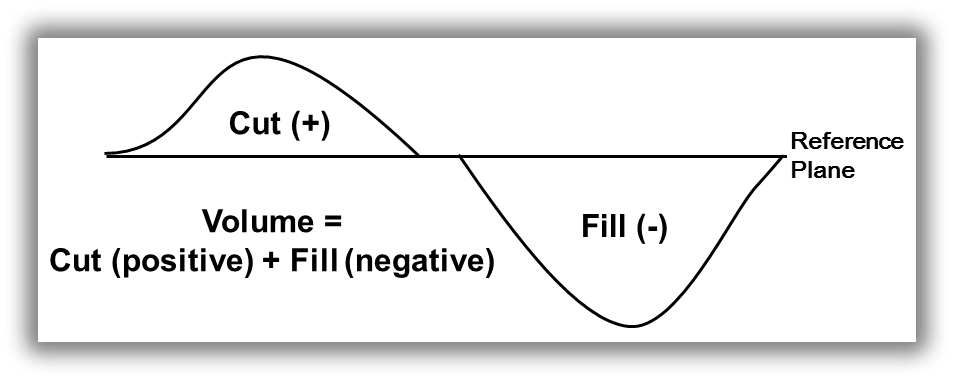
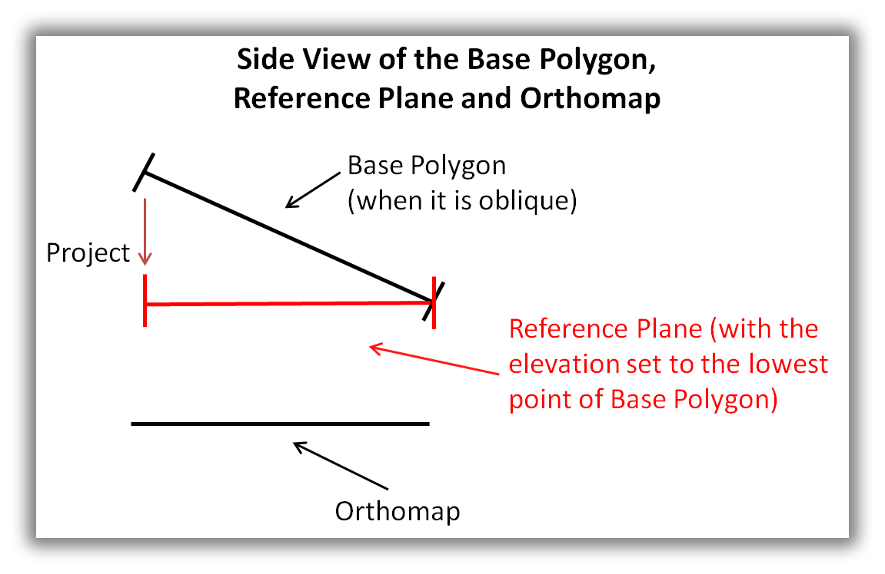
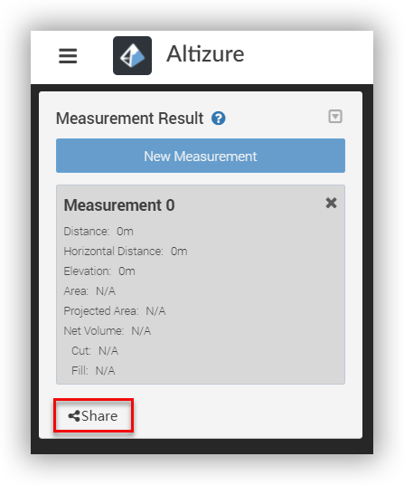
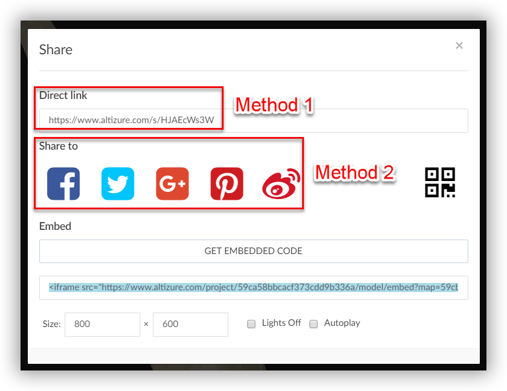
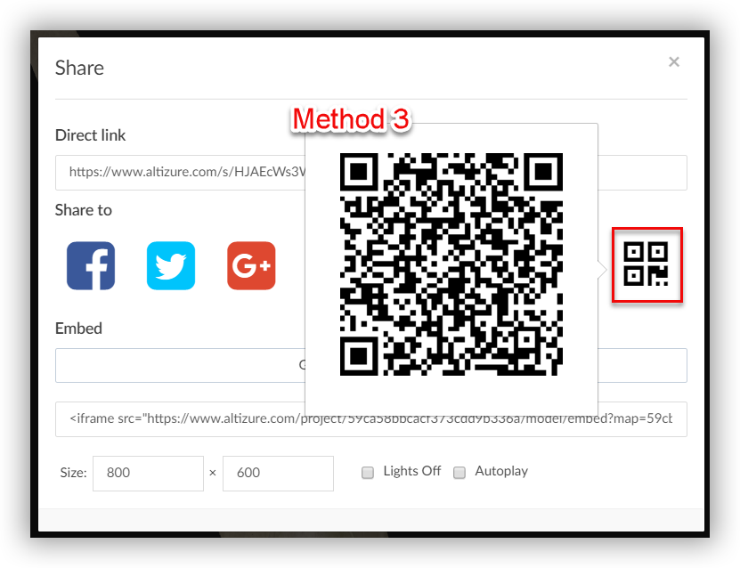
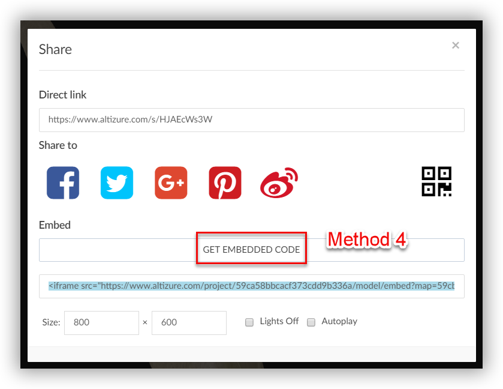

# How to use the 3D Measurement Tools?

* [What can I measure?](#what)
* [Result shown in "unit"](#unit)
* [Share measurement results with my colleagues](#share)

### Where can I find the 3D measurement tools?

Here is a video tutorial:

<iframe width="640" height="480" src="https://www.youtube.com/embed/5knIajH5fM0" frameborder="0" allow="autoplay; encrypted-media" allowfullscreen></iframe>

1. Go to the project page of one of your projects.

2. Click the **Studio** tab on the left sidebar.

3. Click the button **Measurement Tools** on the tool bar to activate the measurement tools

4. Left click to add measurement point\(s\) and draw a polyline. Right click to end the measurement. If the polyline is closed, the area of the enclosed polygon will be computed.

## What can the 3D measurement tools measure? {#what}

1. **Distance**: the distance between the two endpoints of a line segment in 3D, or the sum of the distances of all connected segments.

2. **Horizontal Distance**: the distance between the two endpoints of a projected line segment on the ground plane from the 3D line segment, or the sum of the projected distances of all connected segments.

3. **Elevation**: the vertical distance between the highest and the lowest points of all segment endpoints.

4. **Area**: the area measurement enclosed by the 3D polygon in space.

5. **Projected Area**: the 2D area measurement by projecting the 3D polygon on to the ground plane.

6. **Volume, Cut and Fill**

   Before moving on, we need to first understand two concepts, namely **Base Polygon **and **Reference Plane**.

   **Base Polygon**  
   First, you need to draw a base polygon, which is the area that you want to measure. Usually, base polygon is parallel to the orthomap. This will serve as an important reference for the measurements in the following steps. When you draw the base polygon, you can navigate the model to the vertical viewpoint because it’s easy to get a full view of the 3D model from that angle. By doing so, you can also reduce the possibility that the base polygon forms an oblique angle with the orthomap.

   However, please keep in mind that this does not mean that you should click “Ortho View” when you draw the base polygon. Orthoview is a 2D orthophoto of your 3D model. This means, if you draw a polygon in a 2D picture, the position of the polygon may not be so accurate when the picture is turned into a 3D model.

   **Reference Plane        
   **As explained above, the base polygon is drawn in a 3 dimensional space. This means that inevitably, the base polygon may not be exactly parallel to the orthomap. So here, we’ll introduce a concept called Reference Plane. Reference plane is the projected area of the base polygon on a surface that is parallel to the orthomap. It also has the same height as the lowest point of the base polygon.

* **Cut**: As shown above,\_Cut\_refers to the positive 3D volume above the base polygon \(or “reference plane” when the base polygon is oblique\). Suppose you need to cut the height of the current model to the elevation of the base polygon, this is the volume you need to cut from the current model.
* **Fill**: It refers to the negative 3D volume below the base polygon \(or “reference plane” when the base polygon is oblique\). Suppose you need to fill all the parts of the model below the area of base polygon, this is the volume you need to fill in the current model.
* **Volume**: The total 3D volume enclosed by the 3D surface and a base polygon \(or “reference plane” when the base polygon is oblique\). This volume is the sum of the\_Cut\_and the\_Fill\_where the\_Cut\_is positive measurement above the base polygon while the\_Fill\_is negative, below the base polygon.

## Why do the measurement tools show some results only in "unit"? {#unit}

There are two possible reasons:

1. The project is not reconstructed successfully.

2. The images you upload do not contain GPS information. Or, the GPS information in the images is not precise enough to allow our engine to extract the correct dimension of the 3D models.

## Can I share the measurement results with my colleagues? {#share}

Yes. Click the **Share **button on the dropdown field of **Measurement Result**, and share the 3D model with your colleagues and friends.

In the pop-up dialogue, there're generally**four ways**to share your measurements with others:

1. Share the direct link.
2. Directly share it to other social media platforms, i.e. Facebook, Twitter, Google Plus, Pinterest and Weibo.  
   

3. Share QR code.  
   

4. As for the fourth method, you can obtain an embed code that allows you to insert a 3D model with measurements on your website.  

The 3D model that you can embed in your homepage will be like this.

<iframe src="https://site.altizure.com/project/590c784c1225725be9d360db/model/embed?map=5abdda90f9170d1c6d42a174#autoplay=false" style="border:none;width:640px;height:480px"></iframe>

## Disclaimer {#disclaimer}

The results of these tools are provided as they are. The accuracy of the measurement highly depends on the quality of the 3D reconstruction and the GPS recorded in the input images. Please DO survey ground control points to validate the accuracy before you apply the results to your project.

---

Last modified at {{ file.mtime }}

