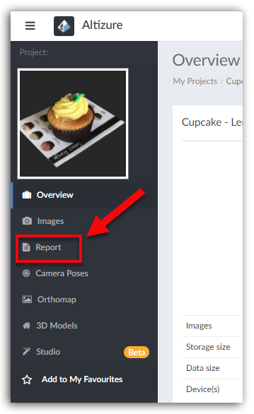

# How to read 3D Reconstruction Report?

For both Free and Pro projects, a 3D reconstruction report will be generated after the project is finished. The report includes the data of reconstruction quality and effectiveness that may be helpful for users to better evaluate their projects.

* [Global results](#global)
* [SFM Result Visualization](#sfm)
  * [Reprojection Error](#-reprojection-error-unit-pixel-)
  * [Projection Distribution SD](#-projection-distribution-sd-)
  * [Rolling Shutter](#rolling)
  * [Camera Pairs of XX% strongest connections](#-camera-pairs-of-xx-strongest-connections-)
* [Instant Orthomap](#ortho)
* [Visibility Map](#visibility)
* [Others](#others)

## Where can I find the report? {#where}

You can click the **Report **button on the left sidebar of the **Overview **Page.

## How can I understand the report? {#how}

The report provides users with all kinds of data. Here in this article, we have listed several items that are particularly helpful for users who want to improve their 3D mapping skills.

### Global results {#global}

In the following table, two figures need special attention. One is the **Number of failed photos**, i.e. those photos are ruled as invalid and are not used in reconstructing the model. The second is the **Number of valid photos**.

Too many failed photos suggest a not-so-high-quality data capture, but 0 invalid photos do not mean a successful data capture. To evaluate the quality of a data collection, users must take into account many factors, including the following 6 pictures in SFM Result Visualization—probably the most useful section in this report.

### SFM Result Visualization {#sfm}

Before moving on, we need to first understand the concept of_keypoints_. When users upload images of a certain object to Altizure’s cloud computing system, it will automatically detect thousands of keypoints on each image. If two keypoints on two different images are detected to be the same, they become_correctly-matched keypoints_. The computer will then extract the features of the object from a set of matched keypoints and generate a 3D model.

The\_matched keypoints\_can only be detected on common areas \(or overlapping areas\) between different images. The larger the common area is, the more keypoints there are. The more matched keypoints are found, the more accurate the 3D model can be.

Please also take a look at [this article](https://blog.altizure.com/what-does-overlap-really-mean-in-3d-modelling-cf8d321bf25), which may help you better understand the concept of keypoint.

#### Reprojection Error \(Unit: Pixel\) {#-reprojection-error-unit-pixel-}

The 2D coordinates of correctly-matched keypoints that our system identifies on at least two different photos, will triangulate a 3D coordinate on the model. This 3D coordinate will then be reprojected back to each photo of those matched keypoints. The Reprojection Error is the distance between the reprojected position of the keypoint on a photo and the 2D coordinate of the same keypoint on the same photo.

This figure visualizes the average reprojection errors in each camera/ photo. Each circle represents a camera or a photo. The colorbar on the right-hand side of the figure shows a certain type of color corresponds to a different degree of reprojection error. The redder the circle is, the bigger the reprojection error will be, and hence, the poorer the reconstruction quality can be.

There may be several reasons causing the large reprojection error: repeated scenes \(e.g. repeated patterns\), blurry photos, or areas covered by weeds and woods, etc.

#### Projection Distribution SD {#-projection-distribution-sd-}

This figure visualizes the distribution of keypoints in each camera/ photo. Each circle represents a camera/ photo. The redder the circle is, the more unevenly distributed the keypoints are on that photo.

The main reason for unevenly distributed keypoints is: the capturing area is not ideal for 3D reconstruction. This includes areas that are lack of patterns or textures, transparent objects or buildings with a reflective surface, etc.

#### Rolling Shutter {#rolling}

This figure visualizes the image quality of each camera/ photo. Each circle represents a camera/ photo. The redder the circle is, the poorer the image quality will be. For circles with a black edge, the image quality might be even worse, and more importantly, the poor quality of those images might severely affect the final reconstruction result.

The influencing factors of image quality include: the flight speed of a drone when capturing data, focal length, light condition, etc.

#### Camera Pairs of XX% strongest connections {#-camera-pairs-of-xx-strongest-connections-}

In 3D reconstruction, only the matched keypoints are considered as valid. Therefore, the keypoints hereafter only refer to the matched keypoints.

This figure visualizes the amount of keypoints on each photo and the connection intensity among cameras/ photos. Each circle represents a camera/ photo, while each line with a camera on each end implies that those two cameras are connected. The redder the circle is, the more keypoints the photo has, and hence, the stronger connection it has with other photos. XX% here means, the top XX% strongest connections are visualized in this figure.

Overlap is the major influencing factor for the above two elements. You can take a look at [this article](https://blog.altizure.com/what-does-overlap-really-mean-in-3d-modelling-cf8d321bf25) for more information. If there are few image connections in certain parts of the mapping area, we would recommend users to increase the overlap in this area.

### Instant Orthomap {#ortho}

During data capture, some objects that do not belong to the area that we are going to reconstruct will also be included in the photos. So, in 3D reconstruction, our system needs to identify the main area that we are going to reconstruct. This is where the Instant Orthomap comes in. It is a intermediate result generated after Structure-from-Motion. It will help the system to identify the reconstructed area.

### Visibility Map {#visibility}

Our report shows the photo coverage of the reconstructed area. The whiter the better. If there's not enough photo in the reconstructed area, users need to add more images.

### Others {#others}

**In the Analysis Card**

**Compute**: Altizure will compute this parameter.

**Adjust**: Altizure will optimize this parameter in 3D reconstruction.

**Keep**: Altizure will not optimize this parameter in 3D reconstruction.

**Per-image Results Card**

**Before**: Before Global Optimization

**After**: After Global Optimization

**Global Optimization**: In this step, our system will minimize the total reprojection error.

For **Mean Reprojection error **and **Standard Deviation Reprojection error**, the smaller the better. If the number still exceeds 2 after Global Optimization, it means the reconstruction quality is poor.

---

Last modified at {{ file.mtime }}

