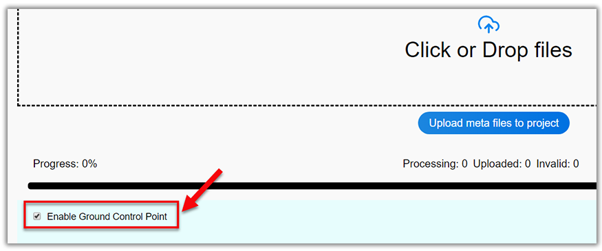
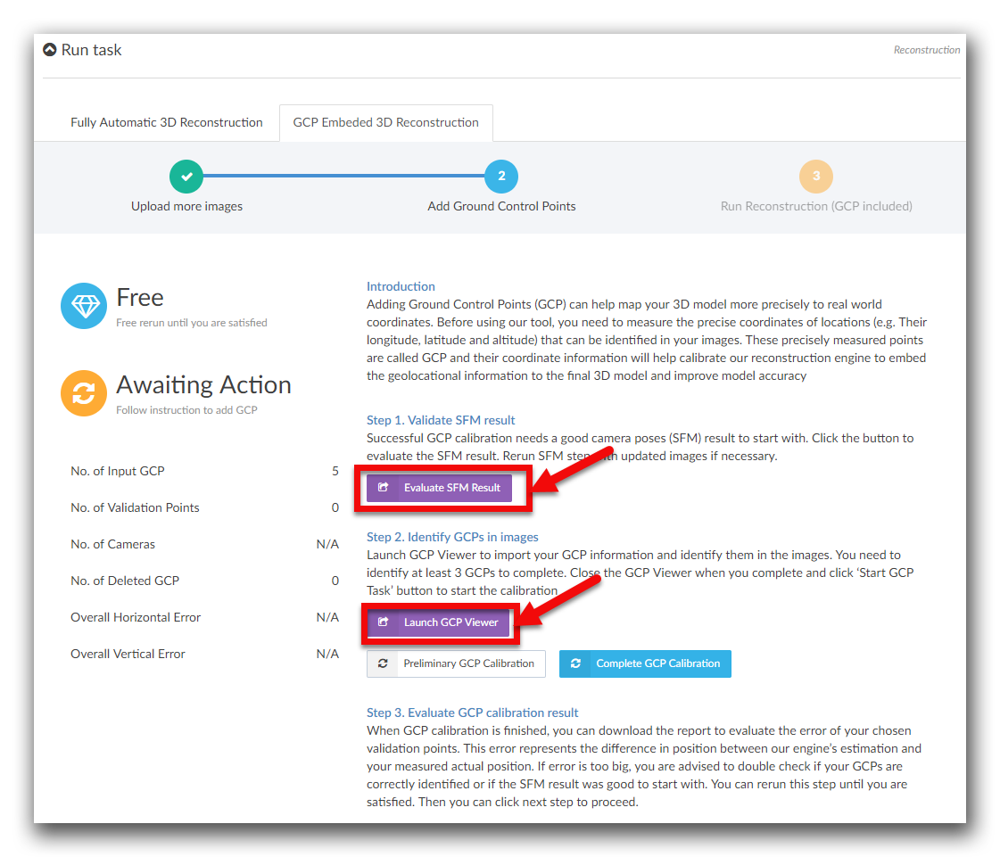
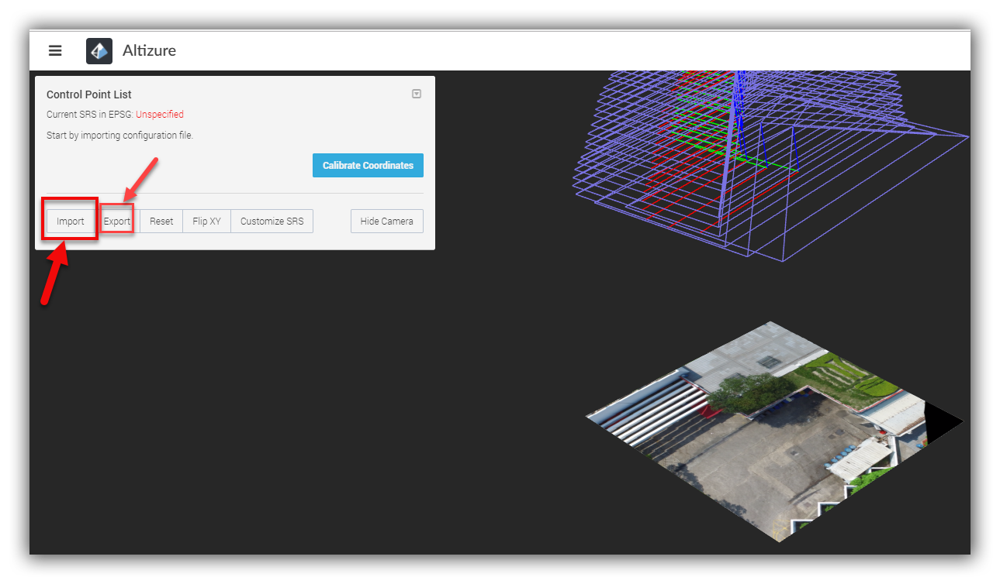
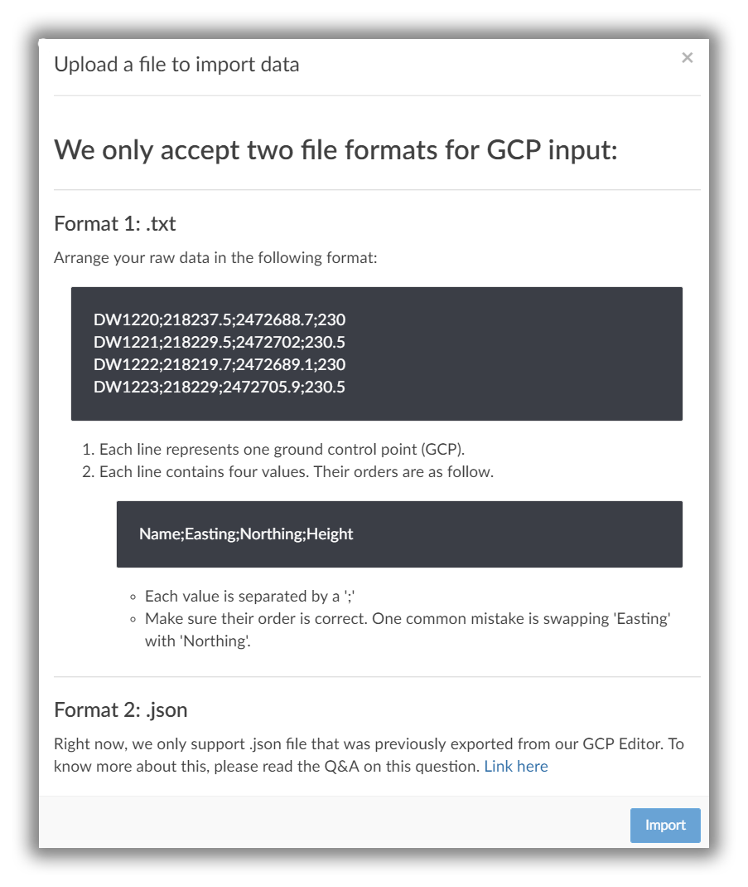
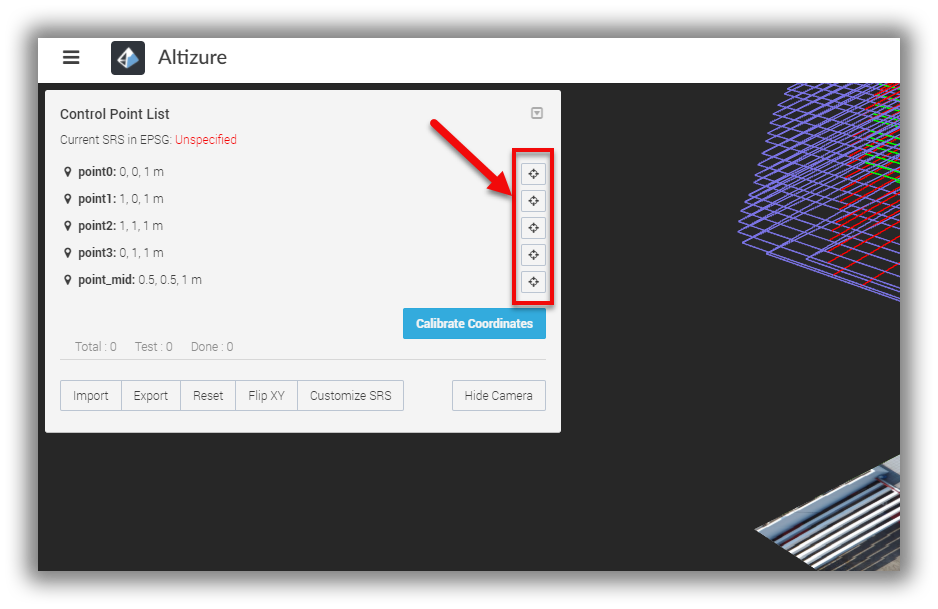
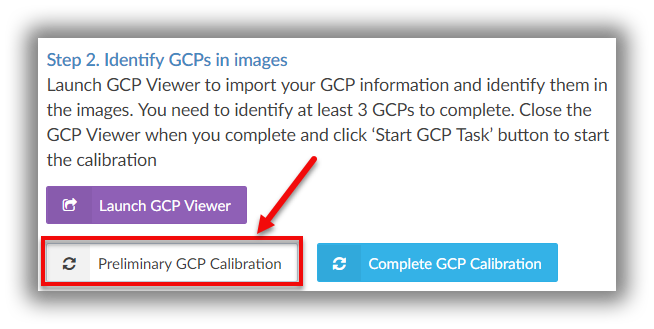
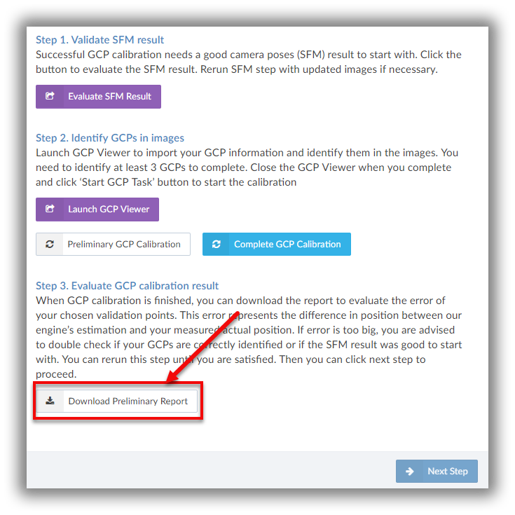
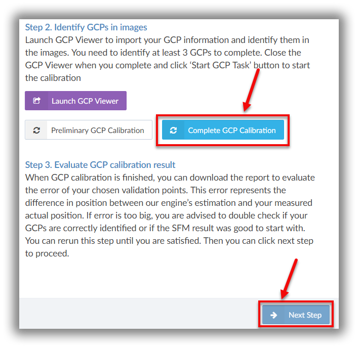

This is for internal testers at the moment. English Tutorial is coming soon.

## Who should read this article?

You must have the basic knowledge of surveying the ground control point \(GCP\) in order to use this feature. In some countries or regions, license is required in surveying ground control points. Please follow the local laws and regulations. At the moment, the testing is by invitation only. If you want to get an invitation, please email us at support@altizure.com. We’ll send you one as soon as we can provide more seats for testing.

## How to insert GCP in Altizure?

Step 1: While creating a project, you need to check the box of **Ground Control Point**.

Step 2: Follow the instructions on the website, upload your photos and create a project.

Step 3: Wait for the **Camera Poses \(SFM\) Task **to finish, and add the ground control points by following the steps below.

Step 4: **Evaluate the SFM Result** and make sure that there’s no huge error. This is important because it would be useless to add GCPs when you have an erroneous SFM result. However, if you do get a wrong result, you can update some images and rerun the SFM step. Or, you can report it to our Support Team by using **Report Problem**.

Step 5: If the SFM result is good, you can move on to the next step. Click the purple icon and open the **GCP Viewer**.

Step 6: Here in this step, you can only see the camera poses with an orthophoto if you add GCPs for the first time in this project \(just as the picture shown below\).

Click **Import **on the top-left panel to upload GCP data.

But before moving on, let's first understand the functions of **Export**. Literally speaking, it means to export the valid data of gcp coordinates that you have already marked on the map in .json file. You can use this function when you want to keep a record.

After you finish marking the GCP positions in at least one photo of a Ground Control Point \(which we'll talk about later\), our machine will regard this point as "valid" and record its position. So, when you **Export **the coordinate data, the .json file you export will include the locations of this GCP.

If you do the same thing for all the GCPs, then you'll have all the coordinates in the exported .json file.

Step 7: There are generally two ways to import data.

The first is to import it in **.txt **format, while the second is **.json **format.

If you are importing the coordinates into this project for the first time, you can only choose to import them in .txt file.

For .json format, as explained above, it is just another option for you to import data.

Step 8: After you upload the GCP information, a top-left panel with several **crosshair icons **will appear. Each icon represents a GCP. You can click it and start to mark the GCPs in the orthophoto.

Step 9: After approximately marking at least three GCPs in the photo, you can click **Calibrate Coordinate **and then **Confirm **it. By doing so, the machine will automatically mark the rest of the coordinates you import. This means that based on the GCPs which you already marked on the orthophoto, the machine can roughly predict other GCP positions.

**Please notice: **This is just **a preliminary marking **that helps you roughly locate the GCP positions in the map. These positions may shift a few meters away from the right spots. You need to adjust them into their exact locations in the following steps.

Step 10: Select a GCP you want to adjust. The photos that the drone shot around this spot, will appear at the bottom of the screen.

Step 11: Click any photo, and you can see **a red crosshair **in it. This is the GCP position either predicted by the machine or previously marked by you in the preliminary marking.

Zoom in the photo and mark your GCP in the photo precisely.

Click **Save**. Or otherwise, the machine will not record the changes you make.

Do the same thing in 5-7 photos for each GCP so that you can triangulate an accurate 3D ground control point.

**Tip: **There’s an **Eye icon **on the bottom-left of the photo. That is the toggle of **a green crosshair **that represents the original GCP position in the preliminary marking. Click it, and you can switch on/off the green crosshair.

Step 12: To assess the GCP calibration quality of your project, you can select **Use for Validation **and label some GCPs as checkpoints. In processing, these checkpoints will neither be used for georeferencing nor for optimization. But by comparing the checkpoint’s 3D position with the coordinate you input, the machine will have a better assessment of the project accuracy. So, you still need to mark 5-7 photos for each checkpoint.

**Tip: It would be better to select the GCPs in the centre of your orthophoto as checkpoints, rather than the ones near the corners or edges.**

**Notice: Please make sure that you have at least 3 GCPs other than the ones you chose as checkpoints.**

Step 13: Close the GCP Viewer and click the button **Preliminary GCP Calibration **to allow the machine to run a preliminary calibration.

Step 14: Check the **Preliminary GCP Calibration Report **and see if there’s any huge error. In case of that, please double check the photos and see if all the GCPs are marked in the right position. Rerun the **Preliminary GCP Calibration **and repeat the above steps until you get a satisfactory result.

Step 15: To make it easier for you to revise the GCP positions, we recommend you to click **Export** and save the GCP data after marking all the GCPs. This allows you to save some time when you want to revise the positions next time.

Step 16: Click **Complete GCP Calibration** when you get a good result, and click **Next Step** to continue.

## **Attention**

1. In order to better triangulate the 3D position of a GCP, you are recommended to mark the GCP from different angles.
2. The GCP should be distinct and clear enough on the aerial photo, so that it’s easy to locate the GCP position on the photo.
3. You need to mark the GCP positions in 5-7 photos for each GCP. For each photo, the GCP position should be at the center of the photo. An example is shown below. It would be better if the GCP position is within the red rectangle area in the photo below.

---

Last modified at {{ file.mtime }}
