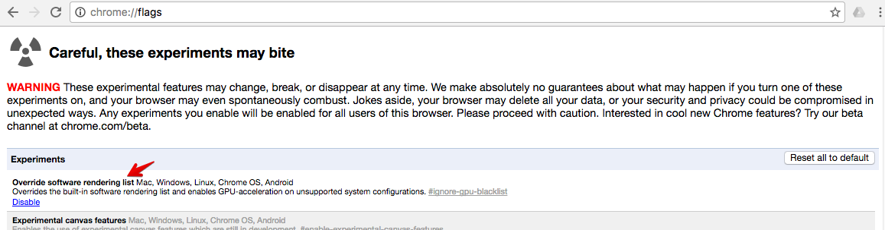

# What are the compatible Web Browsers?

* [WebGL Support](#webgl)
* [Supported web browser](#supportedbrowser)
* [Download Compatible Browsers](#download)
* [Troubleshooting](#troubleshooting)

## WebGL Support {#webgl}

Altizure.com platform uses **WebGL **to offer in-browser real-time displaying of 3D content.

In some older versions of browsers, the WebGL was not supported, or it has not been enabled by default. You can check if your browser is compatible with WebGL at [http://get.webgl.org/](http://get.webgl.org/).

The following browsers support WebGL:

| Platform | Compatible browsers |
| Desktop | Mozilla FirefoxGoogle ChromeOperaSafari \(must enable manually in 7.1.3 \[OS X 10.9\] and earlier\)Internet Explorer**\(version 11 or later\)** |
| Mobile | Android 4.0 with Firefox beta and Google ChromeiOS 8Blackberry browser |

How to enable WebGL in browser?

1. Safari, you can manually enable WebGL:

   * Go to **Safari **&gt;&gt;** Preferences **&gt;&gt; **Advanced **and check **Show Develop **menu in menu bar.
   * Go to **Develop **&gt;&gt; **Enable WebGL**

2. Chrome

   * Type `chrome://flags`in the address bar.
   * "Enable" the "Override software rendering list" as the following image.
   

## What browsers are supported? {#supportedbrowser}

Altizure runs best on the latest version of:

* [Internet Explorer 11](http://windows.microsoft.com/en-us/internet-explorer/download-ie)
* [Google Chrome](http://www.google.com/chrome/)
* [Mozilla Firefox](https://www.mozilla.org/)
* [Safari](http://www.apple.com/safari/)

Altizure supports the current and previous official release of Chrome, Firefox and Safari.

Altizure supports IE version 11 and above.

Each time when a new version is released, we begin to support the latest two versions and stop supporting the previous ones.

If you are experiencing compatibility issues with the site, please make sure you are using one of the supported browsers with the most recent version.

See [http://www.whatismybrowser.com/](http://www.whatismybrowser.com/) if you're not sure what browser and version you're using.

## Download Compatible Browsers {#download}

| Chrome | Firefox |
| :--- | :--- |
| [Desktop](https://www.google.com/chrome/browser/desktop/) | [Desktop](https://www.mozilla.org/firefox/new/) |
| [Android](https://play.google.com/store/apps/details?id=com.android.chrome) | [Android](https://play.google.com/store/apps/details?id=org.mozilla.firefox) |

## Troubleshooting {#troubleshooting}

If you run into problems, make sure your graphics driver and browser are up-to-date. Or, if you prefer, you may install one of the other compatible browsers listed above.

Please contact us at [support@altizure.com](mailto:support@altizure.com) if you have any queries, and remember to send us the hardware spec of your device and a WebGL report which is the screenshot of [this page](http://webglreport.com/).

---

Last modified at {{ file.mtime }}

