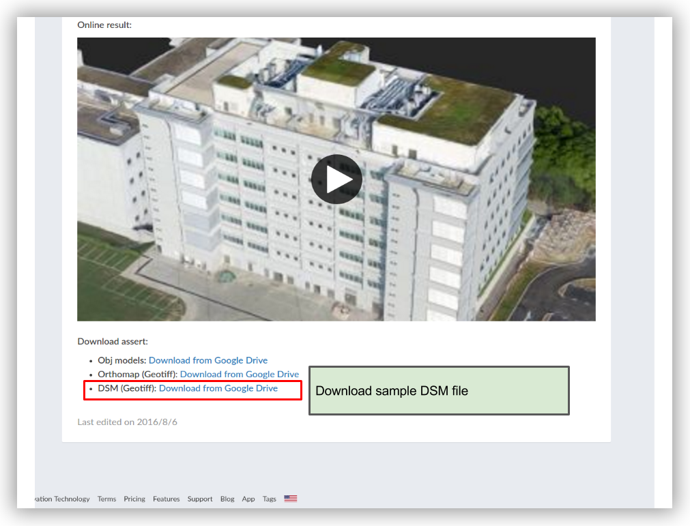
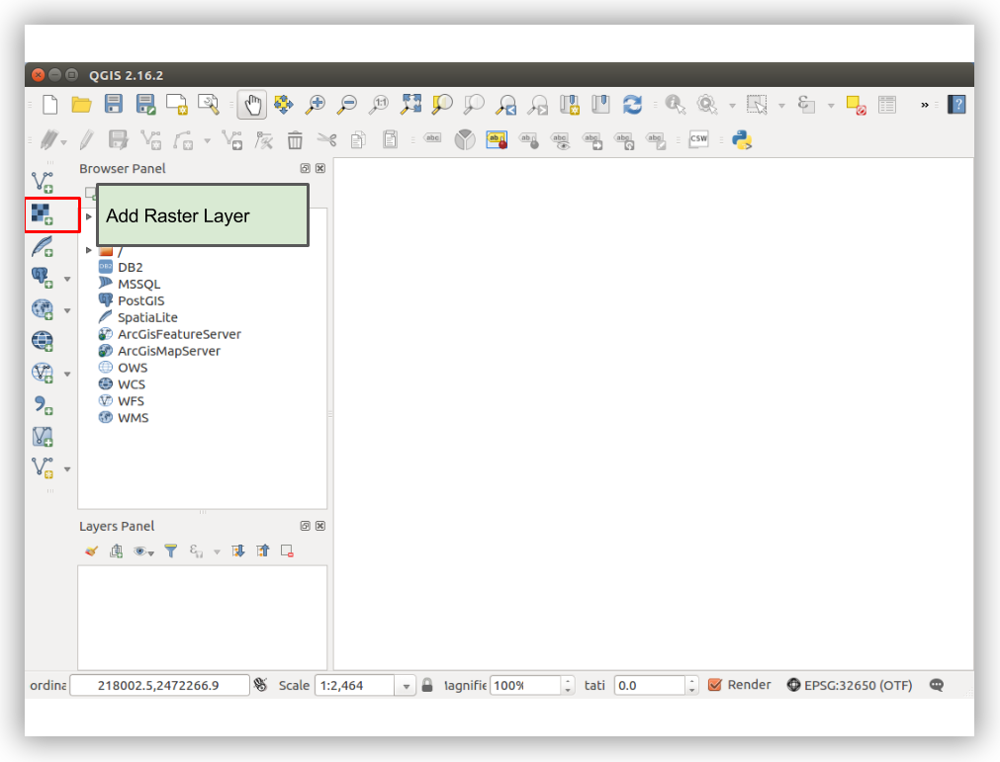
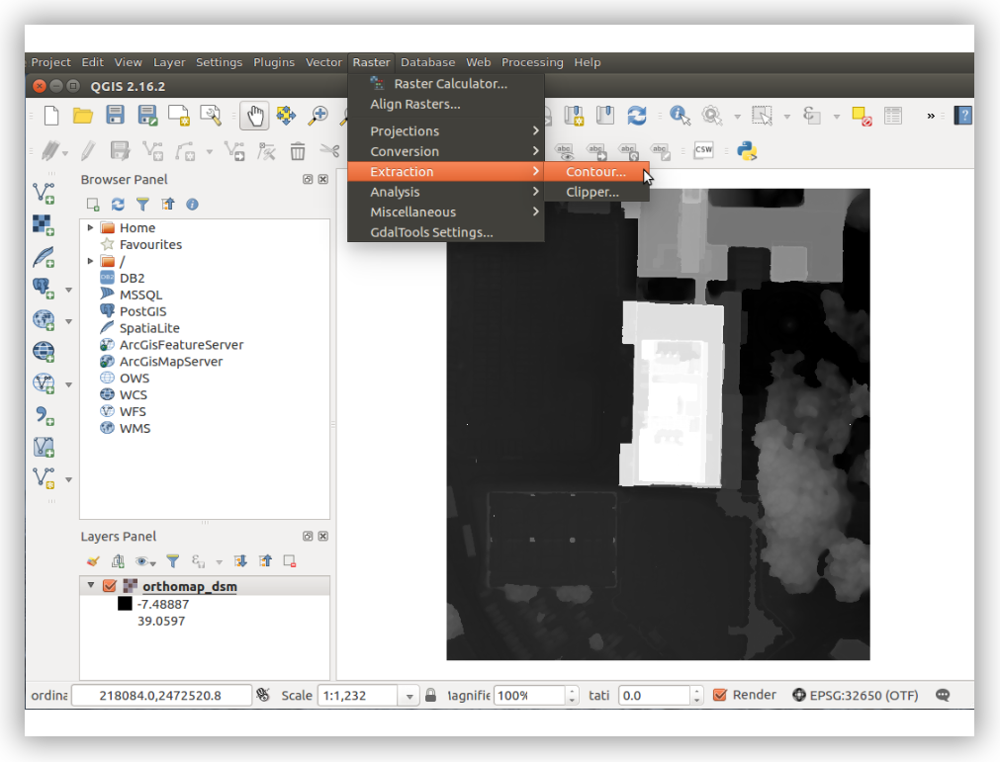
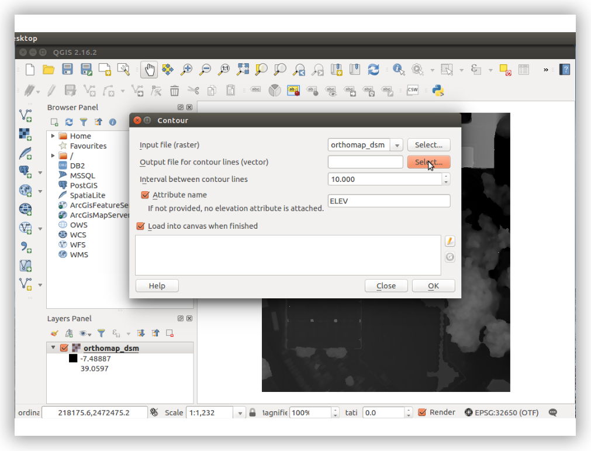
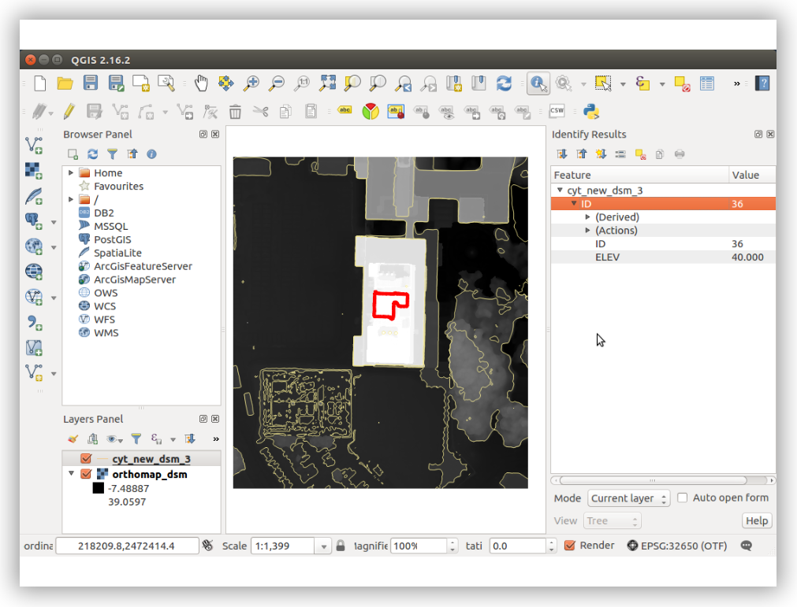

## How to generate a contour map from DSM file using QGIS?

The **QGIS **is an open source free geographic information system software. We will guide you in generating a contour map in **shapefile **format from a DSM map by Altizure.

Step 1: Download the sample DSM file from the bottom of the page [https://www.altizure.com/support/articles/download\_assets](https://www.altizure.com/support/articles/download_assets)

Step 2: Download and install QGIS from [http://www.qgis.org/en/site/](http://www.qgis.org/en/site/)

Step 3: Load the downloaded sample DSM file, “orthomap\_dsm.tif”

Step 4: From menu bar, select **Raster **&gt;&gt; **Extraction** &gt;&gt; **Contour**

Step 5: Configure contour extraction setting. Output location, contour interval, etc.

Step 6: Done

---

Last modified at {{ file.mtime }}

