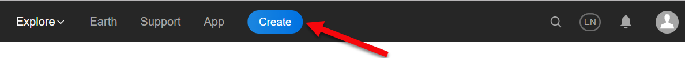
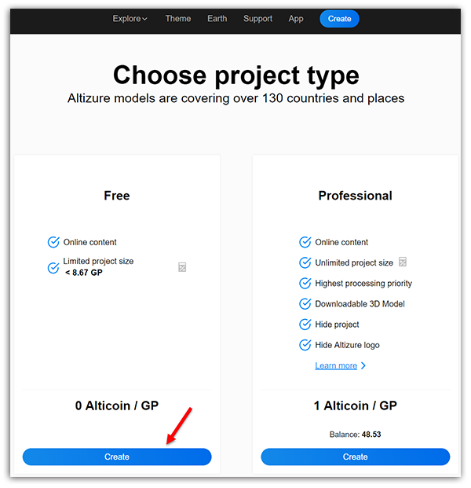
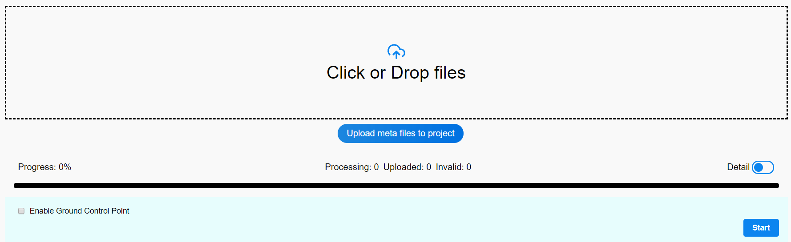
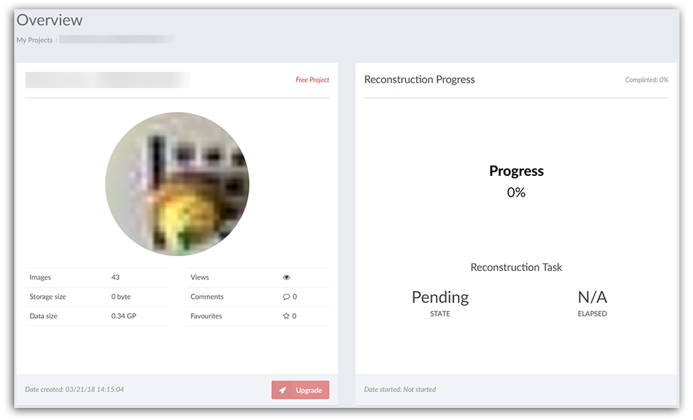

# How to create a 3D model project?

There are all together **THREE** steps.

**Step 1:** Login your Altizure account. If you don't have an Altizure account yet, please read [**this article**](register.md) and create an account. 
  
  Then, go to **Create Project** in the main menu

**Method 1:**

**Method 2:**

**Step 2: **Upload images to Altizure

You can choose to create a Free project or a Pro project / Paid project. For the difference between these two projects, please take a look at [this page](https://site.altizure.com/pricing).

If you are using Altizure for the first time, we recommend you to create a Free Project first.

Click or drag the images to the box. For requirements on uploading photos, please read [Uploading Images](questions-on-uploading-images.md)

**Step 3: **Click **Start** to begin the reconstruction process. 

If your project is successfully started, you'll be transferred to the **Overview** page on which your **Progress Status** will be **Pending**. If not, please go to **Run Task** card on the **Overview** page &gt;&gt; Click **Start** to re-start your project.

---

Last modified at {{ file.mtime }}

