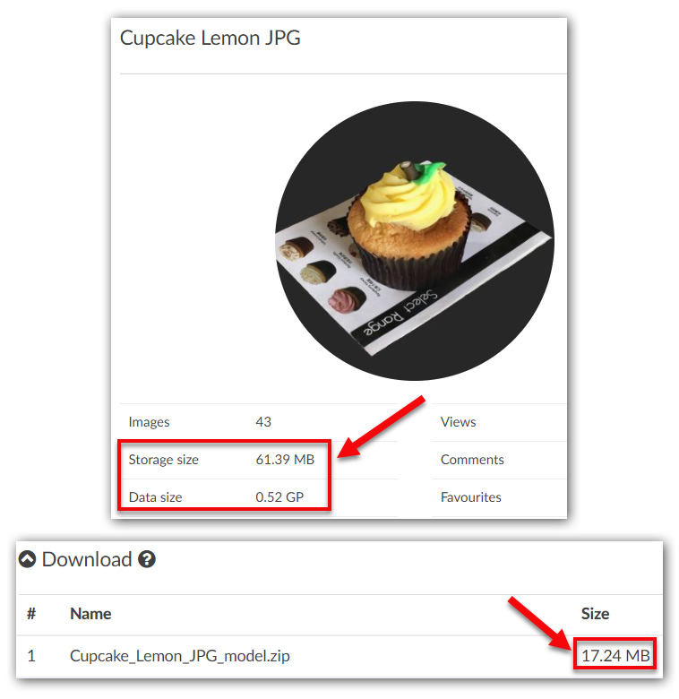
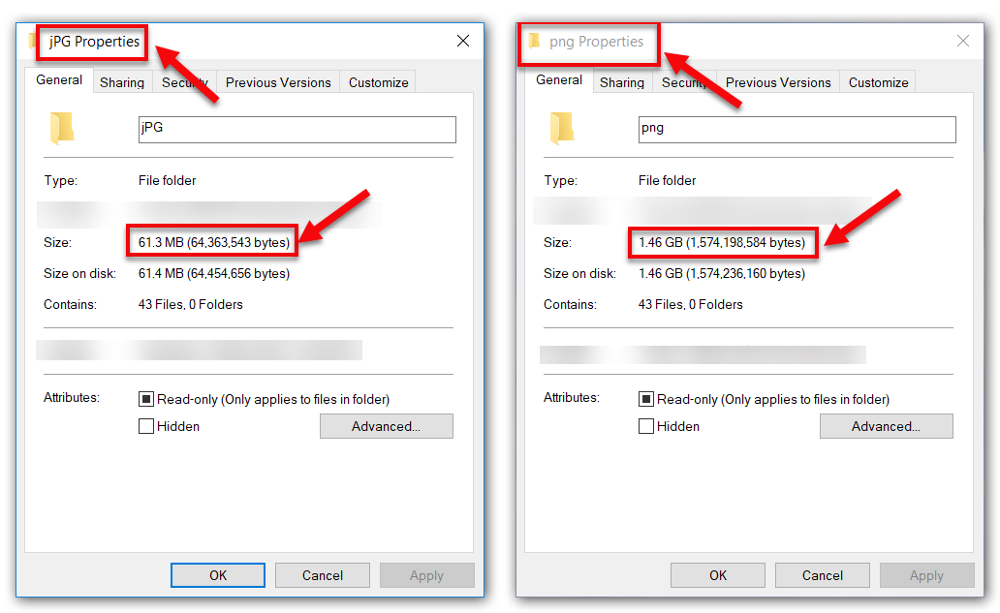
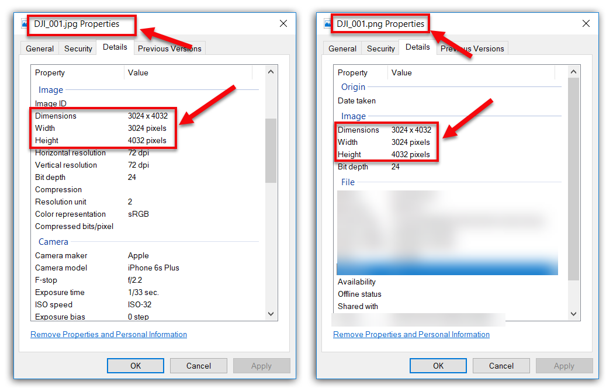
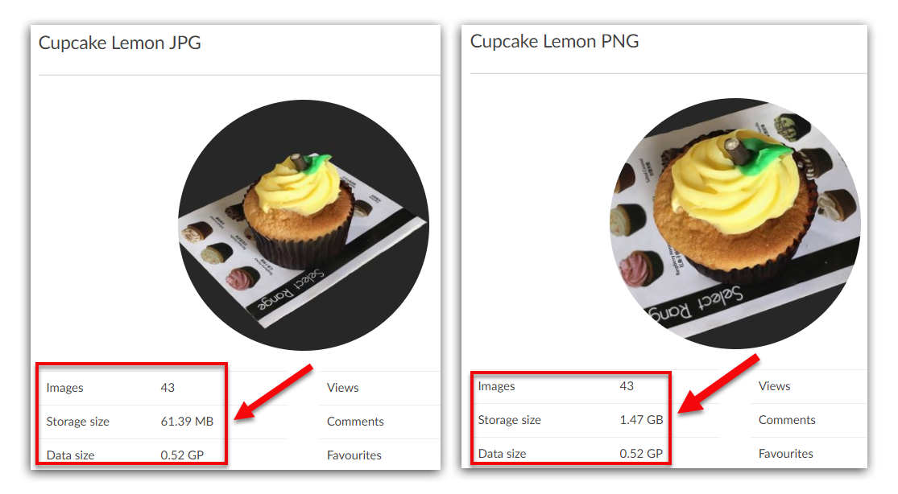
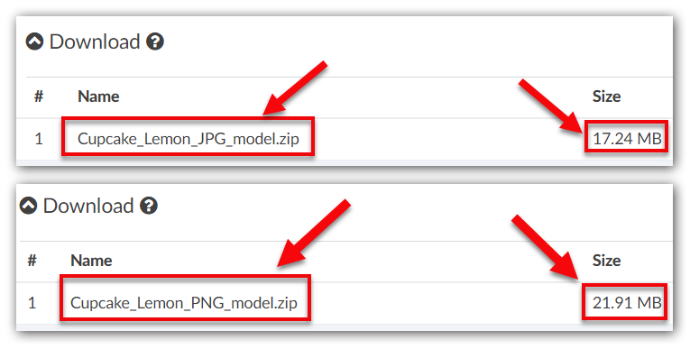

# What are Data Size, Storage Size and Model Size?

This article will clarify the difference between **Data Size**, **Storage Size** and **Model Size** on the **Overview** page.

The example we use here is a 3D project made from 43 pictures. We have created two separate projects with one using the JPG format of the photos, while the other using PNG.

* [Where can I find these 3 figures?](#3)
* [Data size](#data)
* [Storage size](#storage)
* [Model size](#model)

## Where can I find these 3 figures? {#3}

You can find **Data Size** and **Storage Size** by going to the Project card on the **Overview** page.

While for **Model Size**, please go to **Overview** page &gt;&gt; **Download** card, and you'll see the file size of your downloadable asset.

## Data Size {#data}

**Data Size** is measured in pixels. It is the total image resolution of all the uploaded photos. Our computational complexity of a project depends on the data size, so does the [price](https://site.altizure.com/pricing).

Here in this case, we can see the difference of\_file size\_between PNG and JPG photos. Take the example of DJI\_001, the full-size PNG has a file size of 34.9MB, resulting in a total file size of 1.46GB for 43 photos. But for the compressed JPG, its file size is only 1.48MB, making the total file size 61.3MB.

However, if we take a look at the image resolution of each photo, we'll find that no matter how different their file size is, their image resolution will still remain the same, i.e. 3024 x 4032 pixels.

So, as shown above, both projects have the same total image resolutions \(or Data Size\), which is 3024 x 4032 x 43 = 524289024 pixels ≈ 0.52 gigapixels \(GP\).

That is to say, no matter what the photo format is, the image resolution will still be the same.

## Storage Size {#storage}

**Storage Size** is measured in bytes \(e.g. KB, MB, GB\). Storage Size is the space that it takes to store the images on our disk after some kind of image compression. The image resolution of each photo will not be changed after compression.

Storage Size depends on the\_file size\_as we have illustrated above. In the example, the storage size of the PNG project is 1.47 GB, which is much larger than JPG storage size of 61.39 MB. This shows that our computer needs a much larger space to store all the PNG images than it does to store JPG photos.

## Model Size {#model}

**Model Size** is measured in bytes \(e.g. KB, MB\). This is the file size of the 3D model that Altizure reconstructs.

As shown in the example, the size of downloadable asset is influenced by the photo format and the total\_file size\_of the input images. So, for JPG project, the model size is 17.24MB. But for PNG project, the model size is 21.91MB.

---

Last modified at {{ file.mtime }}

