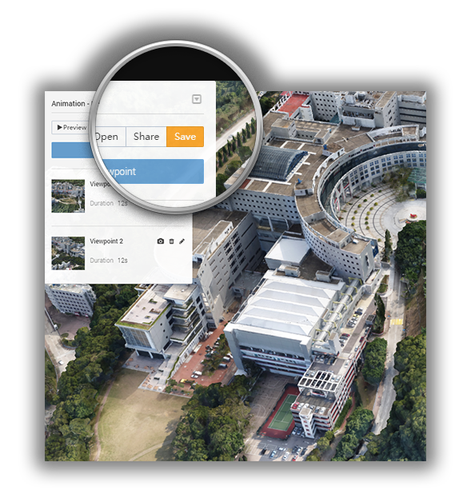

# Flight Animation

At the moment, **only the project owner **can create a flight animation of the project.

* [What is it?](#what)
* [How to create?](#how)
* [Edit my animation](#edit)
* [Create several animations for one project](#several)
* [Share my animation](#share)

## What is a flight animation? {#what}

Once you have a reconstructed 3D model, you can do a lot of interesting things. You can make a video-like **animation**, or flight simulation. Basically speaking, in the viewer, you can choose virtual **view points**, or key frames. Then, the system will automatically generate all the transitional positions and orientations to make a continuous and smooth 3D path between any two view points in the viewer.

The animation is rendered by the 3D viewer, so is seamlessly integrated into the 3D viewer. Together, it makes the interactive exploration of 3D models more enjoyable like a play-back video or a kind of guided tour into the 3D, yet the user could take over the full interactive 3D at any moment.

* A creator can show off the best views of his 3D work by pre-setting animations in the viewer as a guided tour.

* A filmmaker can use it to ''visualize' the effects of his planned camera motion before the on-site shooting.

* A drone pilot can use this animation to simulate his flights, and to fly his drone with this generated flight paths.

The animation video in full resolution is being developed and will be released as soon as it is ready.

## How to create a flight animation for my project? {#how}

An animation consists of a sequence of view points, and the UI allows the users to easily choose any view point from the 3D model.

**Here is a video tutorial 插入视频**

Go to the project page of one of your projects.

1. Click the **Studio** tab on the left sidebar.

2. Click the button **Flight Animation** on the right side toolbar to activate animation editing.

3. Navigate the model to a certain position or a view point in the scene which you want to add in your animation.

4. Click **Add a Viewpoint** to save the viewpoint you choose.

5. Repeat 4 and 5 as many times as you like. You need at least two viewpoints to make an animation.

6. Click **Preview** to play the animation you just made.

7. Click **Save** to save the animation.

## How to edit an animation? {#edit}

* You can edit an animation by using the following functions:

  Add new viewpoints to the animation, delete the viewpoints you don’t like, and re-arrange the order of the chosen viewpoints..

* You can also edit the time duration between any two viewpoints.

## How to create several animations for one project? {#several}

* You can make several different animations for the same project.

* Click **Open ** on the left sidebar to bring up a list of all animations you made before for this project.

* You can open, rename, delete, or add a new flight animation in the list.

## How to share the animation? {#share}

All the animations in the list can be shared by the author.

To share the link to your favorite social media platforms, simply click **Save** and then **Share**. Each animation has its own share link. You can share them separately to different websites.

Just like how you share your 3D model with measurements, in the pop-up dialogue, there're generally **four ways** to share an animation with others.

1. **Share** the direct link.

2. Directly share it to other social media platforms, i.e. Facebook, Twitter, Google Plus, Pinterest and Weibo.  
     

3. Share QR code.  
     

4. As for the fourth method, you can obtain an embed code that allows you to insert a 3D model with measurements on your website.
   

**The animation embedded on your webpage will be like this.** **插入动画模型**

---

Last modified at {{ file.mtime }}

