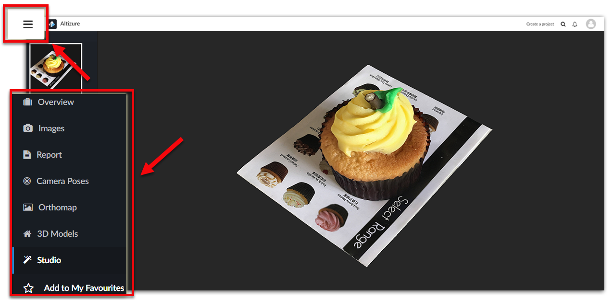
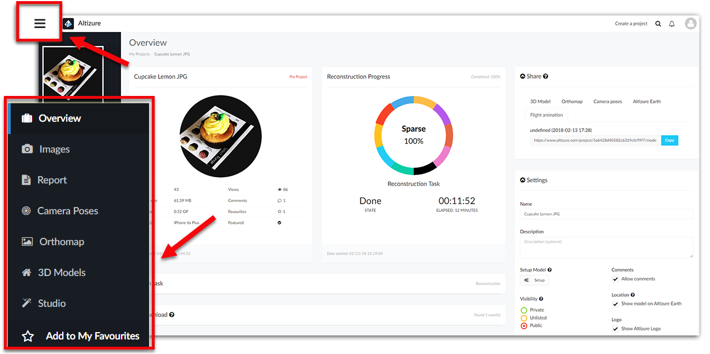

# Menu on the Lefthand side {#left}

## How to open the Left Sidebar? {#left-enter}
You can always open the Left Sidebar by clicking the **three lines icon** on the top left.

## Contents on the Left Sidebar {#left-content}

### Overview {#overview}

The entrance of the [**Project Overview Page**](overview-page.md#overview). You can manage your project here.

### Images {#images}
You can view and manage all the images. Both the valid and invalid photos in the 3D reconstruction process will be included.

### Report {#report}
Click the button and you'll enter the page of 3D Reconstruction Report. It contains detailed technical report of the 3D reconstruction process, such as camera estimation, GPS alignment and visibility map. It also shows a list of per-image results including the number of tie points and reprojection errors. This can help the project owner select better input images. 

If you want to learn more about how to read the 3D Reconstruction Report, please take a look at [this article](3d-reconstruction-report.md).

### Camera Poses {#camera}
It visualizes the sparse point cloud and the camera poses. From these data, you can deduce the flight routes, photographing pattern, flight heights and angles at which you take your photos, or the area with not enough overlap. This will help you evaluate your flight plans.

### Orthomap {#ortho}
It allows you to view the high-resolution 2D orthographic image with different levels of details.

### 3D Models {#3d}
The basic model viewer is the place for users to view and interact with 3D models. Besides real-time viewing, users can socialize here by commenting on the project or by sharing to other social media platform. For more information on **3D Model page**, please take a look at [this article](model-page.md).

### Studio {#studio}
The entrance of the [**Project Studio Page**](studio-page.md).

--- 

Last modified at {{ file.mtime }}

