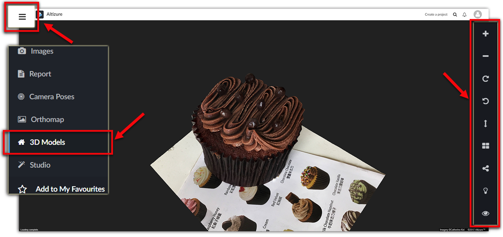
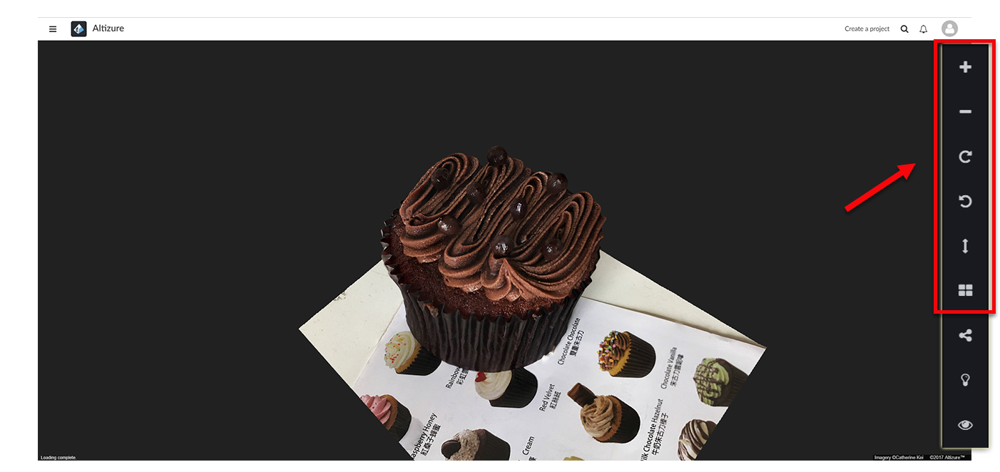
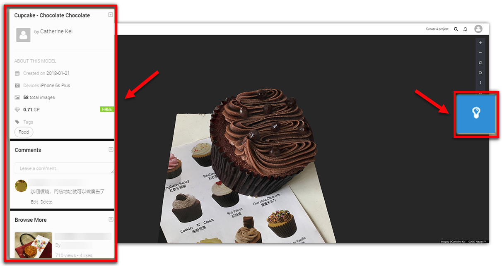
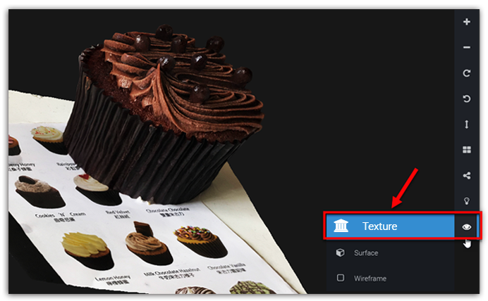
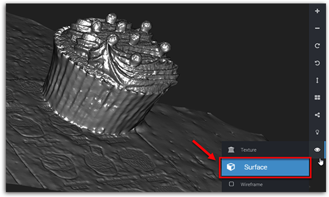
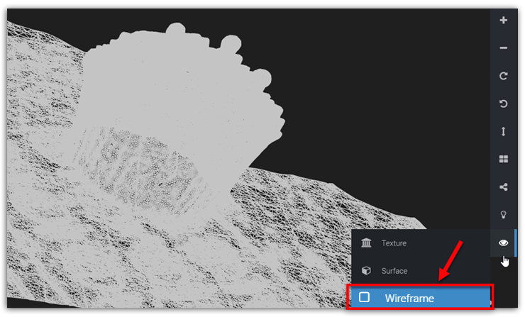

# 3D Model Page {#model}

3D Model Page is the page where all the users can access, not just the project owner. This means, all the functions available on this page can be used by everyone.

* [How to Enter the 3D Model Page](#enter)
* [Viewing Angle icons](#viewingangle)
* [Share icon](#share)
* [Light icon](#light)
* [Viewing Mode icon](#mode)

## How to enter the 3D Model Page {#enter}

Open the [**Left Sidebar**](left-sidebar.md) and click [**3D Models**]. Then, you'll enter the **3D Model Page**.

## Viewing Angle icons {#viewingangle}

This function is the same as the Viewing Angle icon on the [Studio Page](studio-page.md#viewingangle).

## Share icon {#share}

Share the model with your friends or colleagues, or embed it on your home page.

## Light icon {#light}

You can check the project details, make comments or view the comments written by others. In addition, in the **Browse More** card, you can find other similar models made by this user or other users.

## Viewing Mode icon {#mode}
The default viewing mode is **Texture**. But you can choose to view the 3D model in other modes like **Wireframe** mode or **Surface** mode.

The **Project Studio page** has the same function

**Texture mode:**

**Surface mode:**

**Wireframe mode:**

