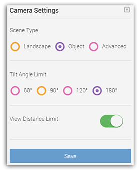
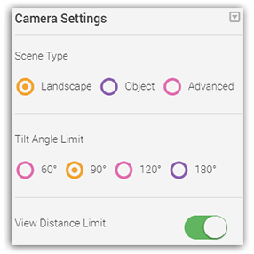
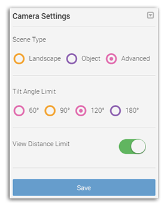

# Can I set the viewing angle and viewing distance limit in Camera Settings? 

## Where is it?
In the [**Project Setup Page**](setup-page.md#enter), you can change the preset values of camera viewing angles or viewing distances in the **Camera Settings **card.

## Guideline {#guideline}

In the **Camera Settings** card, you can see preset values. One is **Object** and the other is **Landscape**.

**Object **type is designed for viewing models of small object. It enables you to view from every possible angle including the bottom.

**Landscape **type is more suitable for models with a ground plane, as the camera will be restricted to always stay on top of the ground to avoid accidental flipping to the bottom.

Besides these preset modes, you can also pick a certain angle from individual tilt angles by clicking **Advanced**.

To remove the restrictions on view distances, you may turn off the toggle on **View Distance Limits**. After that, you can zoom in/out the reconstructed model to any distance.

--- 

Last modified at {{ file.mtime }}
