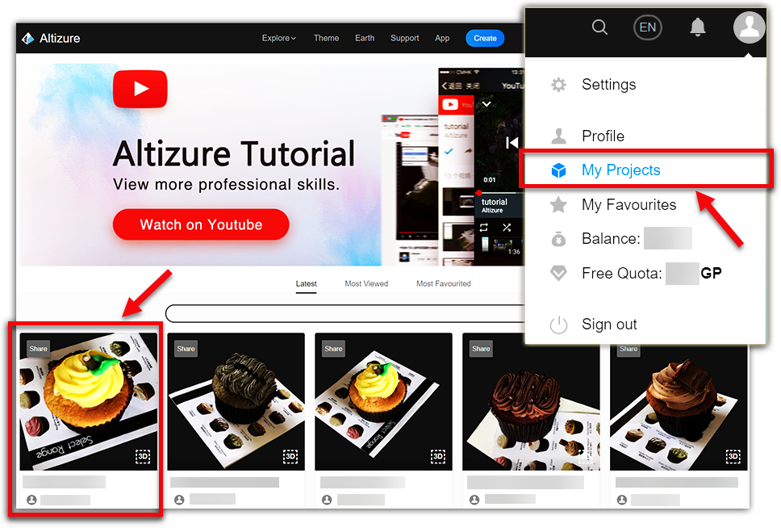

# Overview Page {#overview}

The **Project Overview page** is a dashboard of a single project, in which the project owner can view and manage inputs, outputs, and monitor the online reconstruction process. In particular, the owner can start / stop reconstruction, upload images, download outputs, report problems and change project settings such as project description and visibility.

* [How to Enter the Overview Page](#enter)
* [Project Information card](#info)
* [Run Task card](#runtask)
* [Progress card](#progress)
* [Settings card](#settings)
* [Administration card](#admin)
* [Report Problem card](#problem)
* [Download card](#download)

## How to Enter the Overview Page {#enter}

You can go to the **Overview** page by clicking one of your projects in **My Projects**.

## Project Information Card {#info}

**Storage Size & Data Size:** Please take a look at [this article](datasize.md).

**Images:** Number of Uploaded Images

**Device:** The equipment you use to take the photos.

**Views:** Number of views by other Altizure users.

**Comments:** Number of comments by other Altizure users.

**Favorites:** Number of favorites by other Altizure users.

**Featured:** Whether the project is **Featured** by our community manager or not.

## Run Task Card {#runtask}

**Add:** You can add images to the project

**Stop: **You can stop the reconstruction process of the project.

**Start: **Sometimes, your project does not successfully receive the reconstruction command. You can **re-start the project** by clicking this button. If it's still not working, please use the **Report Problem** function on this page.

**GCP Embedded 3D Reconstruction \(Invitation Only\): **You can add Ground Control Points on this tablet. If you want to enable this function, please send your credentials on surveying and mapping to **support@altizure.com**, and apply for the access.

## Progress Card {#progress}

### Meaning of different statuses {#meaning}

* **N/A:** You haven’t started the project yet. Please click the **Start **icon on the **Run Task **card to start the reconstruction process.
* **Pending:** Your project is now waiting in a queue. Altizure has received you reconstruction command, but all the machines are running tasks at the moment. So, your project is put in a queue waiting for the reconstruction. The waiting time mainly depends on the number and the size of the projects waiting in front of you.

  **Please notice** that when your project is waiting in a queue, if you stop or restart the project, it will go to the end of the queue, and this will extend your wait time.

* **Not enough images:** There are not enough pictures in your project. Every Altizure project requires at least two images. You can go to **"Run Task &gt; Fully Automatic 3D Reconstruction &gt; Add" **on the Overview page to upload more images, then click **Start **to restart your project.

* **Fail:** The reconstruction of this project is failed. This might be caused by several reasons, e.g. insufficient overlapping photos, underexposure/ overexposure, blurry photos, etc. If you have any questions about the result, please use **Report Problem **on the Overview page to report the problem.

* **Unchanged:** The images of the project are unchanged. So, no need to rerun the project.

* **Done:** The project is finished successfully.

## Settings Card {#settings}

**Name: **You can change the name of your model.

**Description:** You can write a short introduction of your model or anything you like. Other users can see the description when viewing your model.

**Setup Model:** The entrance of the [**Setup Page**](setup-page.md).

**Comments:** For both Free and Pro projects, you can **Allow **or **disallow **the comments on the from other users. If you allow comments, the comments will be shown on the [**3D Model**](model-page.md#light) page.

**Location: **If the input images contain GPS information, your model will be geo-referenced and be displayed on Altizure Earth. For both Free and Pro projects, you can check or uncheck this option.

**Logo:** Professional project users can turn off this function if they don't want to show Altizure logo when presenting the model to other viewers.

**Visibility**: You can set the project as **Public**, **Unlisted **or **Private**. For Free projects, you can only maintain the default setting as **Public**.

* **Public **setting will list your project in our [**Explore**](https://www.altizure.com/) page, meaning that everyone could discover and view your content.

* **Unlisted **setting will not list your project in our site; it can only be accessed by its hyperlink \(URL\). This allows you to share the link of the model to a specific group of audience. However, please note that anyone can view the model as long as they have the link.
In addition, the link to the model should ends with `/model`, i.e. the [**3D Model page**](model-page.md).

* **Private **setting will make your project entirely private and safe. Only the project owner can view the model.

## Administration Card {#admin}

**Upgrade: **You can upgrade your Free project to Pro project. If you do not have enough Alticoins in your account, you need to buy more in the [**Pricing**](https://site.altizure.com/pricing) page. More details on [ways to upgrade projects](upgrade-free-to-pro.md).

**Transfer:** If you want to transfer the project to another user, you can type in the registration email of the new owner. Please notice that once you transfer the project to the other user, the ONLY thing you can do with the model is to use the function on the [**3D Model page**](model-page.md). You CANNOT do any other operations.

**Remove:** You can **delete **the project by clicking **Remove**.

## Report Problem Card {#problem}

If you have any questions with the project, you can use this function to report the problem to us.

For instance, you can ask "Some parts of my model are not well reconstructed, why is that?" Or,  "The project stops at XX stage in the reconstruction process."

## Download Card {#download}

Professional project users can download their models in OBJ files here. For more details, please check [this article](downloadable-assets.md). You can download our sample 3D model files from [here](downloadable-assets.md#sample).

**Cropping result** & **Water Result:** If you have cropped your model or added a water surface to your model, you can download the cropping path or water path here, and merge it with your OBJ model by using Format Converter in Altizure Desktop \(**Full project &gt; crop&water**\).

**Size of downloadable assets:** Here in this example, it's 21.91MB. Please take a look at the explanation of **Model Size** in [this article](datasize.md#model).

---

Last modified at {{ file.mtime }}
