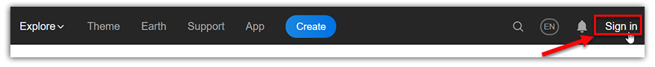

# Sign up for an Altizure account

Step 1: Click **Sign in** on the top menu.

Step 2: Click **Create an account**.

Step 3: Type in your account information and click **Create an account**.

Step 4: Click **Authorize Altizure**, and finish the Sign Up.

For users with two or more Altizure accounts, sometimes, if you frequently signin or sign out your Altizure accounts, you may need to click **Not &lt;Account Name&gt;** and it will direct you to another **Sign in Page**.

---

Last modified at {{ file.mtime }}

