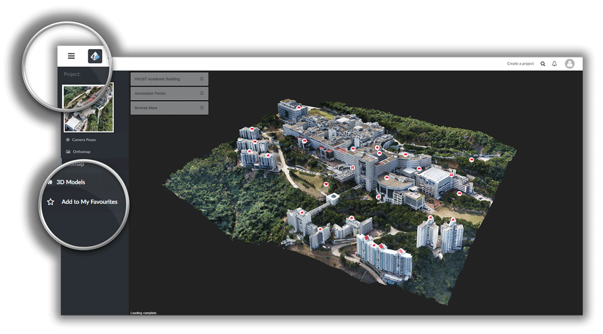

# Share, Embed, Add Favorite

* [Share my model](#share)
* [Embed a model into a web page](#embed)
* [Mark a model as my favorite](#favorite)

## How do I share my project on social media? {#share}

Sharing your project to a social media site is as simple as one click. Click the **Share **button in the viewer, pick the site of your choice and there you go!

Currently, we support direct sharing to Facebook, Twitter, Google Plus, Pinterest and Weibo.


## How can I embed a project into a web page? {#embed}

If you have a blog / a personal homepage, instead of posting just a link of your project, you can directly show the 3D model to your homepage visitors. By**embedding**the project to your webpage, you can make sure that every visitor views the result directly without any extra click on a link.

Embedding your project is very simple:

* Click **Share **in the viewer &gt;&gt; Click **Get embedded code **&gt;&gt; Copy the code and paste it to the source code of your webpage

An example of the embedded code is as follows:

```
<iframe src="https://site.altizure.com/project/590c784c1225725be9d360db/model/embed#autoplay=false" style="border:none;width:640px;height:480px"></iframe>

```

You may also change a few settings before grabbing the code, for example, specifying the size of the embedded window, choosing whether the result will auto-play and choosing whether the 3D model will automatically orbit around its center when it is first loaded.

**Here is an example of an embedded project:**

<iframe src="https://site.altizure.com/project/590c784c1225725be9d360db/model/embed#autoplay=false" style="border:none;width:640px;height:480px"></iframe>

## How do I mark a project as my favorite when I found a really nice model made by someone else? {#favorite}

Click the **Menu **icon on the top left of the model page, and then click **Star**☆ in the left sidebar to mark a project as your favorite. Our system will notify the author that you like his/her work!


---

Last modified at {{ file.mtime }}
