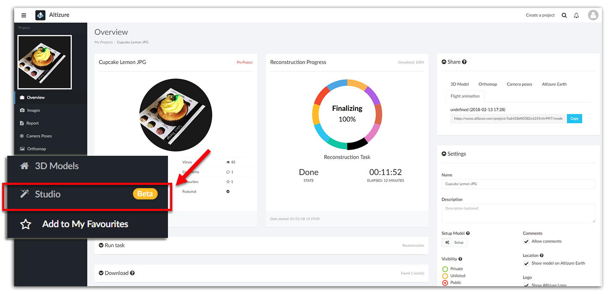

# Studio Page {#studio}

**Studio** page is a model viewer with advanced functionalities, such as measuring distance between any two points, picking a point to get its real-world coordinate, and switching between different viewing modes to view model wireframes or geometries.

* [How to enter the Studio Page](#enter)
* [Viewing Angle icon](#viewingangle)
* [3D Measurement icon](#measure)
* [Flight Animation icon](#ani)
* [Get Coordinates icon](#coor)
* [Seen Images icon](#images)
* [Viewing Mode icon](#mode)

## How to enter the Studio Page? {#enter}

Go to **My Project** >> Select one of your projects >> open the [Left Sidebar](left-sidebar.md), select **Studio**.

## Viewing Angle Icon {#viewingangle}

This function is the same as the **Viewing Angle** icon in the **Setup** page & **3D Model** Page. As you can see on the tab, you can zoom in/out, rotate or tilt the model. You can also view the model by using your computer mouse, e.g. scroll your mouse wheel to zoom in/out, left-click to drag your model left or right, right-click to rotate/tilt your model.

**But please be aware** that if you click **Ortho View**, you will have a 2D orthomap instead of viewing the model from the top in a three dimensional space.

## 3D Measurement Icon {#measure}

If the model is already aligned to a real world coordinate frame, you can do many 3D measurements on the model. For instance, you can measure the distance, area, volume, cut and fill of the model. For more details on how to use 3D Measurement Tool, please take a look at [this article](3d-measurements.md).

## Flight Animation Icon {#ani}

Basically speaking, with this function, you can make a video-like animation, or flight simulation. 

For more details on how to use the Flight Animation Tool, please take a look at [this article](flight-animation.md).

## Get Coordinates Icon {#coor}

If the model is successfully aligned with GPS information, you can obtain the cooridnate of any point on the model.

Please note that this function is not available online if the model is located in Mainland China. According to Chinese regulations, if the location of the model is in Mainland China, users need to upgrade the project to Pro and sync it with Altizure Desktop. Then, users can use this function offline in Altizure Desktop.

## Seen Images Icon {#images}

You can randomly pick a location on the model, and the computer will show you the images around the spot that you pick.

## Viewing Mode Icon {#mode}

The default viewing mode is **Texture**. But you can choose to view the 3D model in other modes like **Wireframe** mode or **Surface** mode.

The **3D Model** page has the same function. [**More details**](model-page.md#mode).

---

Last modified at {{ file.mtime }}

