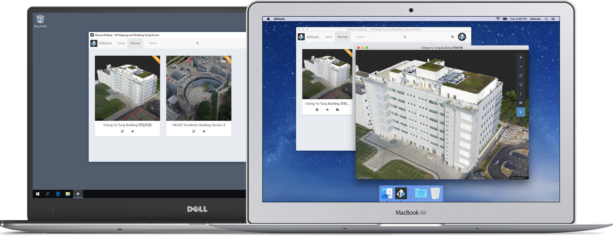
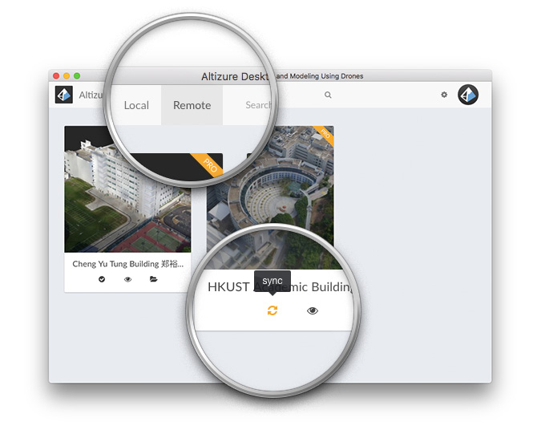
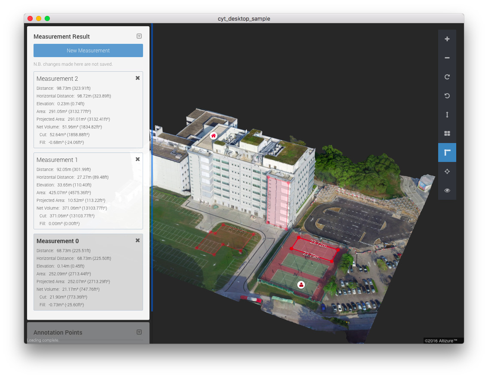
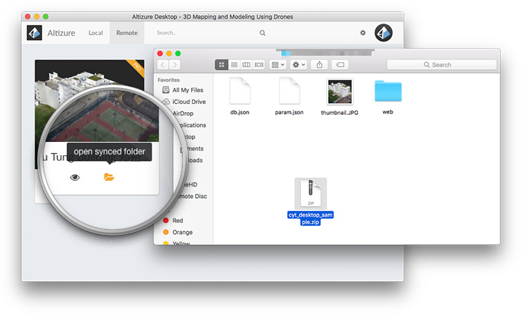
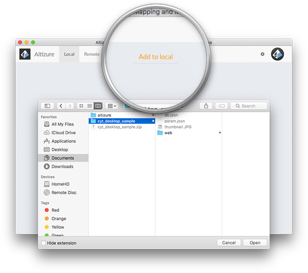

# What is Altizure Desktop?

---

Altizure Desktop is a desktop application for professional users of Altizure.

It can be freely downloaded from [Altizure](https://www.altizure.com/download), and installed on any of your desktop computers. It is cross-platform, running either on Windows PCs or Mac PCs. It goes also with a sample data [Cheng Yu Tung Building](https://drive.google.com/file/d/0BzhX08l_Z0GOX2RtM0J4ZHRqaGs/view?usp=sharing) to start.

* [Overview](#overview)
* [Functions of Altizure Desktop](#function)
* [Sync Pro projects with Altizure Desktop](#sync)
* [What can be synchronized with the Desktop?](#what-sync)
* [How to pack the synchronized data for backup or sharing?](#pack)
* [How to add a packed synchronized data to Altizure Desktop?](#add-pack)
* [3D reconstruction in Altizure Desktop](#3d)

## Overview {#overview}

With Altizure Desktop, you can manage efficiently your professional data, offline and online, locally on your desktop machines and remotely on the Altizure.com .

Currently, it is _de facto_ an offline 3D viewer!

You can offline view and browse 3D models stored on your local computer. The local viewing is often much faster as there is no internet bandwidth restriction. This allows you to demonstrate your professional project to your clients, in a more convincing manner and even without any internet connection.

The **Local** contains a list of projects stored in your local computer. You can use **Add to Local** to add any local projects into this list for viewing.

The **Remote** lists all your projects on the Altizure cloud once logged-in, using your Altizure account, it is your "My Projects" at altizure. You can download any of downloadable projects. A Pro project is downloadable regardless of being private or public. The projects are synchronized between your local machine and Altizure.com.

When downloading projects, you are synchronizing your Pro project in **Remote** between your local machine and the Altizure cloud. You can also redistribute the downloaded local projects to others, who can then add these projects to **Local** with **Add to Local** .

Last but not least, it is intended that this desktop offline viewer could be **customized** for our professional partners and users. You may send the request to support@altizure.com if you are interested in developing customized desktop applications with your own logo embedded.

## Functions of Alizure Desktop {#function}

1. **Synchronize**, and **view** your Pro projects **offline**.
2. Take measurement in distances, areas, volumes, offline.
3. Check GPS or local coordinate of the models, offline.
4. Toggle the rendering mode in **textured shaded** / **flat shaded** / **wireframe**, offline.

**As the projects need to be downloaded from Altizure, these powerful features are only for Pro projects.**

## How to synchronize your Pro projects with your Desktop? {#sync}

1. Go to the **Remote**.
2. Login with your Altizure account.
3. Find the Pro project you want to sync, and click the **Sync** button. When the project is synchronized, the **Sync** button will be marked up with a "tick".
4. If the sync fails due to some network problem, please click the **Sync** button again.

## What will be synchronized with the Desktop? {#what-sync}

1. The 3D models.
2. The measurements you have marked up in the Altizure studio.
3. The annotations you have created in the setup page.

## How to pack the synchronized data for backup or sharing? {#pack}

1. Go to the **Remote** tab.
2. Find the synchronized project, and click the **Open synced folder** button.
3. Pack everything listed in the folder to a zip file.
4. Now you can backup this zip file or deliver it to your clients. You can later unzip and load it into **Altizure Desktop**.

## How to add a packed synchronized data to Altizure Desktop? {#add-pack}

1. Download and install the Altizure Desktop if you have not done so.
2. Unzip the packed data.
3. Go to the **Local** tab.
4. Click the **Add to Local** button, and choose the unzipped folder.
5. The project will be listed in the **Local **tab for your quick access.

## Can I reconstruct a 3D model in Altizure Desktop? {#3d}

No. All 3D reconstruction is computed on altizure.com. Altizure Desktop helps you to manage your Pro projects on your computer, offline.

---

* Download Altizure Desktop at [altizure.com/download](https://www.altizure.com/download)
* Sample offline data for Altizure Desktop [Cheng Yu Tung Building](https://drive.google.com/file/d/0BzhX08l_Z0GOX2RtM0J4ZHRqaGs/view?usp=sharing)

---

Last modified at {{ file.mtime }}

