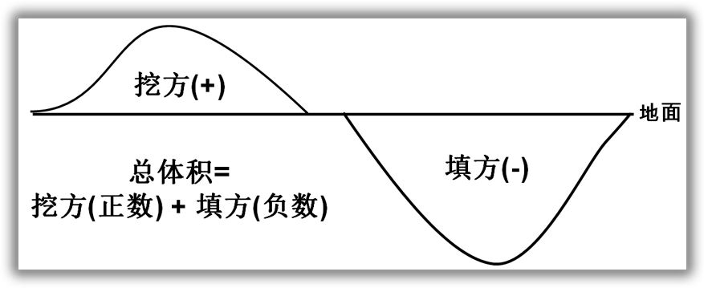

# 三维测量工具

无论是**免费项目**还是**专业项目**，用户均可使用测量工具。但用户只能**在自己所拥有的项目中**，使用测量工具。

* [测量工具可测量什么信息？](#what) 
* [测出的距离以“单位Unit”为单位？](#unit)
* [与同事分享测量结果](#share)

## 如何使用测量工具?
1. 打开一个我的项目
2. 点击左侧边栏的 **模型工坊** 分页
3. 在工具栏中点击 **测量工具** 按钮激活测量工具
4. 左键点击模型添加测量点绘制折线，右键点击结束绘制。如果折线头尾相接则可以封闭为多边形用于测量面积。

<iframe frameborder="0" width="640" height="498" src="https://v.qq.com/iframe/player.html?vid=u03747zl6sw&tiny=0&auto=0" width="640" height="480"></iframe>

## 测量工具可以测量什么信息？ {#what}
1. **距离**： 所画折线的三维长度。
2. **投影距离**： 所画折线在地平面上的投影长度。
3. **面积**： 所画多边形的三维面积。
4. **投影面积**： 所画多边形在地平面的投影面积。
5. **高度**： 所画折线中最高点和最低点的高差。
6. **总体积**：所画折线包围区域与地面之间的体积，其中地面的高度为所画最低点的高度。总体积是挖方和填方之和，挖方数值为正，填方数值为负。
7. **挖方**：所画折线包围区域在地面以上的体积，其中地面的高度为所画最低点的高度。假设用户把现有模型夷平为地面，这是需要从模型中挖去的体积。
8. **填方**：所画折线包围区域在地面以下的体积，其中地面的高度为所画最低点的高度。假设用户把现有模型填平为地面，这是需要往模型中填充的体积。

## 为什么我的项目中的测量工具，只能测出“单位”的距离？ {#unit}
可能有两个原因：
1. 您的项目没有被正常重建
2. 您上传的图像中不包含GPS信息，或者相关信息准确度太差，导致我们无法获取场景的尺寸。

## 我怎么把测量结果告诉同事？ {#share}

非常简单。用户只需要点击测量工具选项卡中的 **分享** 按钮，将3D模型分享给自己的同事和朋友。

点击 **分享** 按钮后，会出现如下图所示的弹出窗口。总的说来，用户有 **4种** 分享自己模型的方式：

1. 直接分享链接
2. 直接分享到社交平台上，如 Facebook, Twitter, Google Plus, Pinterest 和微博

3. 分享二维码

4. 至于第四种方法，用户可以通过获取嵌入代码，将模型及其测量结果嵌入到自己的网页上。

用户在自己主页上嵌入的 3D 模型，如下图所示：

<iframe src="https://site.altizure.cn/project/590c784c1225725be9d360db/model/embed?map=5abdda90f9170d1c6d42a174#autoplay=false" style="border:none;width:640px;height:480px"></iframe>

## 免责声明
相关的测量结果均没有经过人工校准，其精度取决于输入图像的精度以及图像中记录的 GPS 精度。务必进行精度检验后才可用于实际工程项目中。

--- 

本文档最后修改于 {{ file.mtime }}
