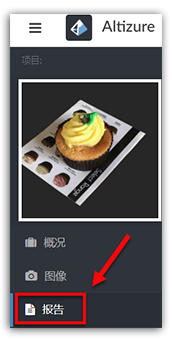
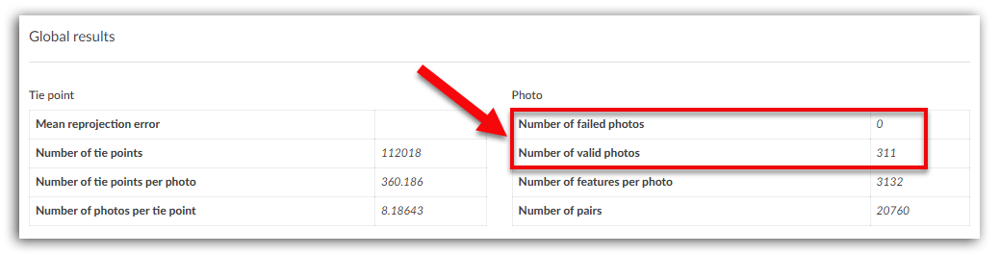
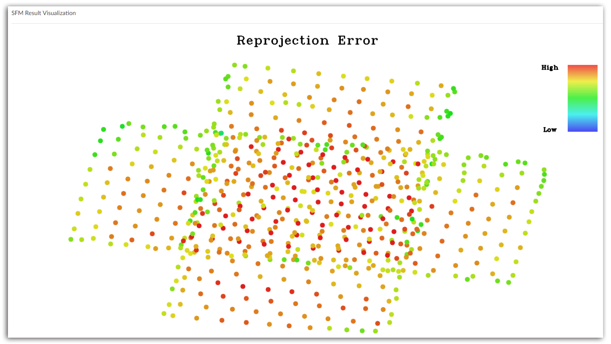
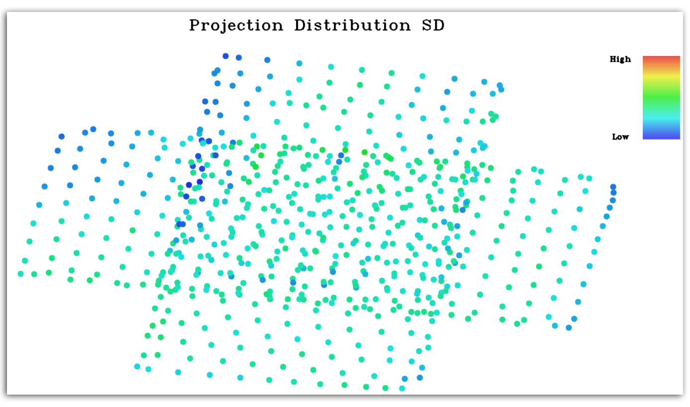
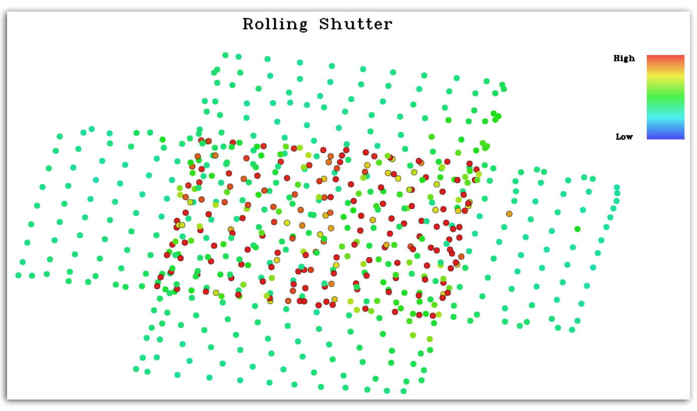
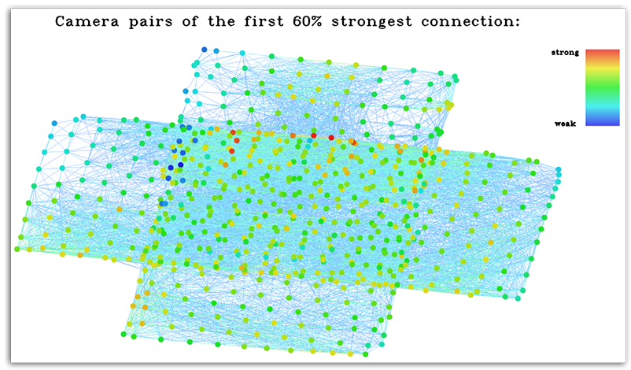
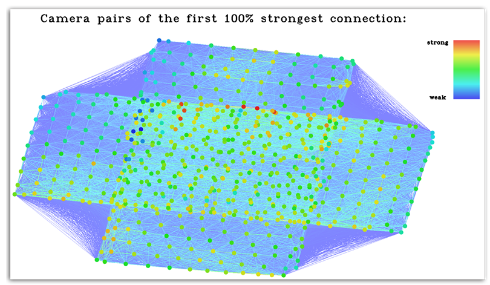
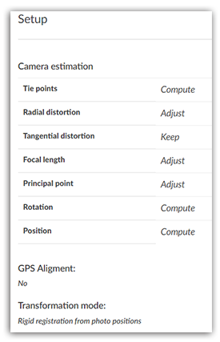
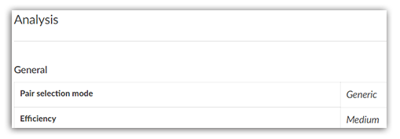
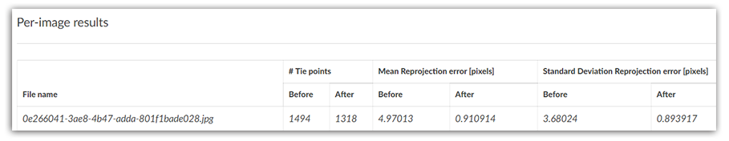

# 如何解读Altizure的三维重建报告？

不论是免费还是专业的项目，在重建完成后都会有一份重建的报告。报告列出了关于重建质量和成效的统计。

* [Global results](#global)
* [SFM Result Visualization](#sfm)
  * [Reprojection Error](#reprojection)
  * [Projection Distribution SD](#sd)
  * [Rolling Shutter](#rolling)
  * [Camera Pairs of XX% strongest connections](#camera)
* [快速鸟瞰图](#ortho)
* [图像覆盖报告图](#visibility)
* [报告条目的中英对照表](#others)

## 这份报告在哪里？ {#where}

点击 **项目概况** 页面，左手菜单的 **报告** 按钮，即可查看报告。

## 如何解读报告？ {#how}

本报告为用户提供一份较详尽的数据的列表。下面我们将重点介绍几个比较有帮助的数据，用户可利用这些数据对自己的飞行航线设置和三维模型进行评估。

### Global results {#global}

在下表中，有两个数据值得注意，一是 **Number of failed photos**，即本次三维重建中，无效的照片数量。二是 **Number of valid photos**，即本次三维重建中，有效的照片数量。

如果无效照片太多，则代表本次图片采集不是很成功。不过，请注意，若无效照片数为0，也不代表本次拍摄质量很高。我们还需要通过看三维模型成果及其他数据，来衡量本次拍摄是否成功。而下面的 **SFM Result Visualization** 可能是其中最重要的了。

### SFM Result Visualization {#sfm}

不过在进行讲解之前，我们需要先理解下，**特征点** 的概念。当用户上传照片到云端时，Altizure系统会自动在每张图片上识别出数千个特征点。如果每两张图片上有相同的特征点，那么我们就可以将这两个相同的特征点匹配在一起，形成一对 **匹配的特征点**。这样的匹配特征点有很多，而Altizure系统则会从众多图片中提取成千上万对的匹配特征点，生成三维模型。

这些特征点只可能出现在两张照片的重叠区域。重叠区域越大，意味着可以被识别的特征点越多。而特征点越多，模型越精细。

  
#### Reprojection Error（单位：像素）{#reprojection}

以下这幅图可视化了每个相机的平均投影误差。每个圆代表一个相机。圆圈的颜色越红说明这个相机的投影误差越大。这里的投影误差的意思是：我们的系统会在至少两张图片上，识别出匹配的特征点。而这些匹配特征点的二维坐标会在模型上重建出来一个三维坐标。投影误差就是这个三维坐标重新投影回每张匹配特征点的图像后，与同一张图片上特征点的二维坐标，之间的距离，单位是像素。点的颜色越偏红，代表重建质量越不好。

造成投影误差大的原因包括：场景重复模式比较多（如，拥有重复的图案），场景植被比较多，照片有模糊等

#### Projection Distribution SD {#sd}
以下这幅图可视化了特征点在每张图片中的分布。每个圆代表一张图片。圆圈的颜色越红说明特征点在这张图片上分布越不均匀。

特征点分布很不均匀的原因包括：部分区域纹理较少，有反光，透明或其他不适合三维重建的物体。

#### Rolling Shutter {#rolling}

这幅图可视化了每张图片的质量。每个圆代表一张图片。圆圈的颜色越红说明这张图片的质量越差。 如果这个圆圈有黑边，说明这张图片的质量会使得最终重建的模型质量严重变差。

影响图片质量的因素有：相机拍摄时的移动速度，相机拍摄时的模糊，光线过强或过弱，等其他因素。

#### Camera Pairs of XX% strongest connections {#camera}

在三维重建过程中，只有匹配的特征点才会被系统认为是有效的，若某个特征点无法与其他特征点相匹配那么这些特征点就会被自动删除。所以，下文中的特征点都特指匹配的特征点。

这幅图可视化了每个照片上的匹配特征点数量，和相机照片之间的关联强度。每个圆代表一个相机照片。照片之间的连线说明这两个照片之间有关系。圆圈的颜色越红，说明这个相机照片上有更多的匹配特征点，也说明相机之间的关系越强。 x的意思是在这幅图中，在所有相机关系中，前x%强的相机关系被可视化出来。

影响图片上的特征点数量，及相机之间的关系强弱的因素，主要是图片之间的重叠度。如果一块区域的连接很稀疏，建议增加这块区域的照片

### 快速鸟瞰图 {#ortho}
在进行图片采集时，有一些图片会将不属于重建部分的内容也拍摄进去，但三维重建时，系统需要确认，哪些是属于此次拍摄的主要区域。而快速鸟瞰图起到的就是这个作用，它在Structure-from-Motion后生成，是个中间结果，大致评估这次需要重建的范围。

### 图像覆盖报告图 {#visibility}
报告图表示，本次重建的区域被图像覆盖的程度。颜色越白，说明图像覆盖率越好。如果想重建的部分图像覆盖不够，用户就需要补拍。

### 报告条目的中英对照表 {#others}

#### Setup卡

Tie points 三维点

Radial distortion 图像径向畸变

Tangential distortion 图像切向畸变

Focal length 焦距

Principal point 图像中心

Rotation 相机朝向

Position 相机位置

**状态解释：**

* Compute 指Altizure会计算

* Adjust 指Altizure 在三维重建过程中，会优化这个参数

* Keep 指Altizure 在三维重建过程中，不优化这个参数

#### Analysis卡

Pair selection mode: Generic >> 采用通用的相机对选择模式

Efficiency: Medium >> 效率：中等

#### Global Results卡

Tie point 三维点

Mean Reprojection Error：reprojection error的中位数

#### Per-image Results卡

卡中显示的Before (之前) 和 After (之后)，指的是 全局优化前的和最后全局优化后的差异。

Mean Reprojection error 和 Standard Deviation Reprojection error 越小越好。如果全局优化后，error仍超过2，就代表重建质量不是很好。

全局优化：在这一步里，系统会将三维重建过程中的总投影误差最小化。

---

该文档最后修改于 {{ file.mtime }}
