# 如何使用地面控制点GCP（测试中）

## 谁能使用地面控制点？

使用地面控制点制作三维模型，需要专业的测量知识。在某些国家和地区，更需要相关的许可证。请用户遵守当地法律。目前，此功能只提供给个别受邀请的用户进行测试。大陆地区有兴趣获邀测试的用户，需进行实名认证，请将测绘资质的证书（可选），公司的工商注册信息或营业执照，是否有联系人的身份证邮箱电话等，电邮至：support@altizure.com申请。谢谢

本文面向的读者群体是有相关专业背景知识的用户。

## 网页操作流程

第一步：建立项目时，请选择 **加入地面控制点（GCP）**

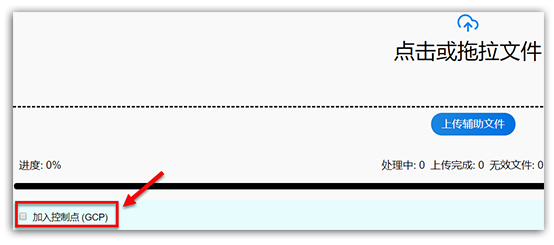

第二步：按以往建立项目的步骤，上传照片

第三步：当系统运行完 **相机重建（SFM）**步骤后，用户可进行如下添加地面控制点的步骤

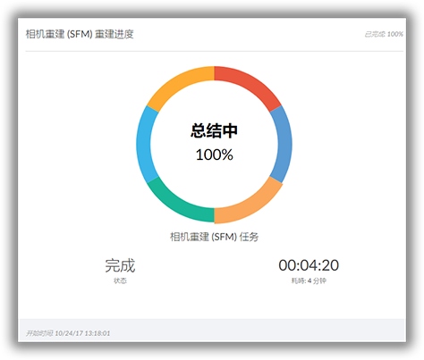

第四步：请按下图指示，**检查相机重建（SFM）的结果**，确认没有严重的错误后，再进行下一步。否则，即使添加地面控制点（GCP），也没任何作用。如有严重错误，用户可重新运行SFM步骤，或在 **项目概况** 页面，使用 **报告问题**，将问题报告给我们团队。

第五步：若SFM结果正常，请按下图指示，进行下一步，**在输入的图像中标示GCP**，打开GCP编辑器。

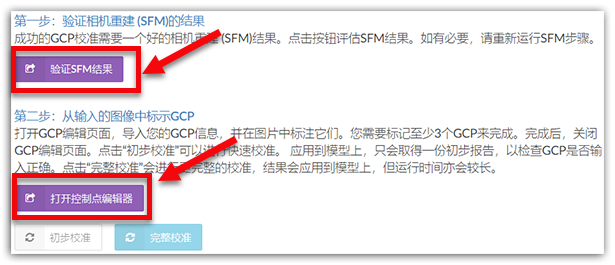

第六步：若用户是首次在此项目中添加地面控制点（GCP），此时在这一页面，只能看见相机位置和一个初步的正射图（如下图所示）。

请选择左上方面板中的 **导入数据**。 

不过在进行下面讲解前，我们先来理解下，什么是 **导出数据**。从字面上理解，**导出数据** 就是将已经上传的GCP坐标的有效数据，以.json的文件格式导出来。那 **有效数据** 又是什么意思？当用户按照下面步骤，在一个控制点中的至少一张照片，标识了控制点位置，那么，这个控制点的坐标数据，就会被认为是 **有效的**。这时候，当您导出.json文件时，文件中就会包含这个控制点的数据。所以，如果您将所有的GCP坐标都标识出来，那么，您导出文件时，就会包含所有GCP的数据。

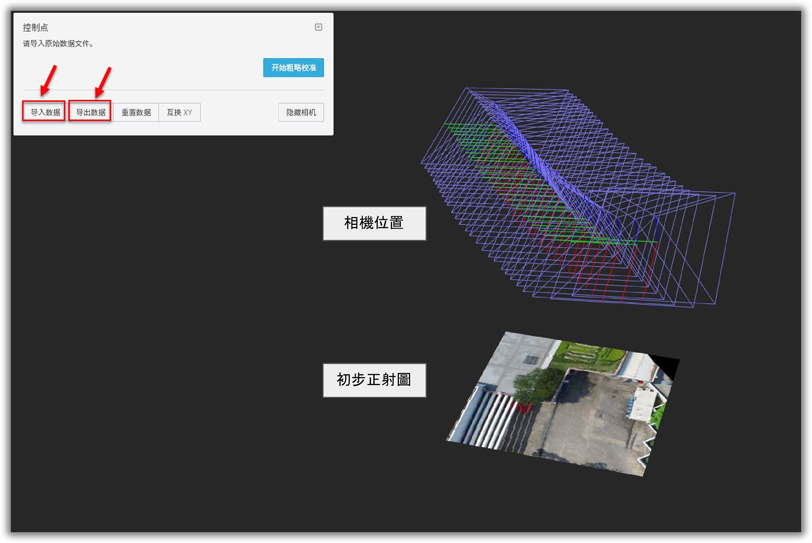

第七步：导入的格式有两种。

第一种是导入**.txt**格式的，用于首次导入，文件只需要有真实世界的坐标。请自行使用任何文件编辑器（例如notepad，wordpad等），请按弹窗中的格式要求准备好，然后导入。

第二种是导入 **.json**格式的，正如上文所述，是Altizure GCP编辑器导出的文件格式，包含有效的控制点坐标信息，目的只是为用户提供另外一种选择。

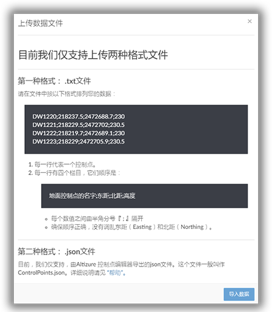

第八步：导入后，在操作板会看见输入的控制点。每个控制点都会有一个准星图标，点击图标，就可以粗略地在正射图上标示GCP了。

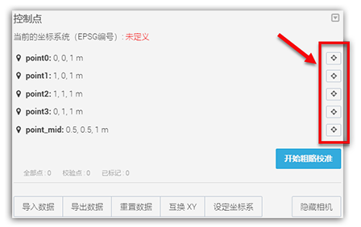

第九步：在正射图上标示最少三个控制点后，就可以按 **开始粗略校准**，系统会根据已经标识的3个或3个以上的控制点，估算出其他控制点在正射图上的位置。如下图所示，红色的控制点是用户自己手动标识的，而绿色的控制点则是系统通过已标识的3个控制点，自己推算出来的。

**请注意：此时，自己粗略标识和系统估算出的这两类控制点在正射图上的位置，不是最终系统采用的，也不会被系统认为是“有效的”。它们只用作提醒用户控制点的大概位置。**

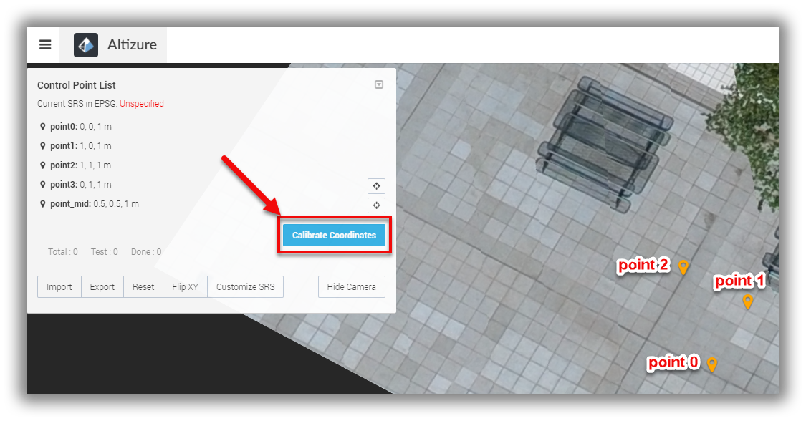  
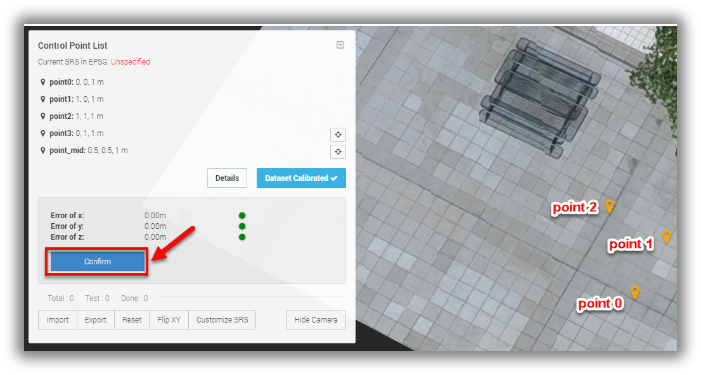  
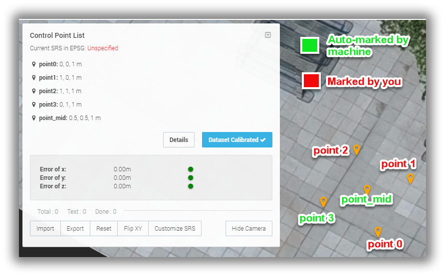

第十步：选择您想标示的控制点，屏幕下方会显示，无人机当初在这个控制点附近拍摄的所有照片。

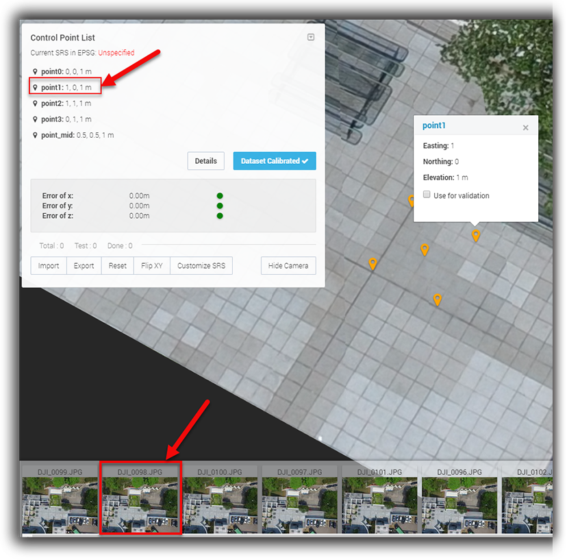

第十一步：点击任何一张照片，您可以看到照片里有个红色的准星。此时这个红色的准星所表示的位置，就是在粗略校准时，系统估算出的控制点位置。

放大照片，在照片中把控制点更精确地标示出来，位置越精确越好。点击 **保存**，保存新标识的位置。

所以，当初在测量控制点时，需拍摄一些有关控制点位置的照片，包括控制点附近的标志物，这样能更精确地在正射图上标识位置。一般每个控制点需要标示5-7张照片。

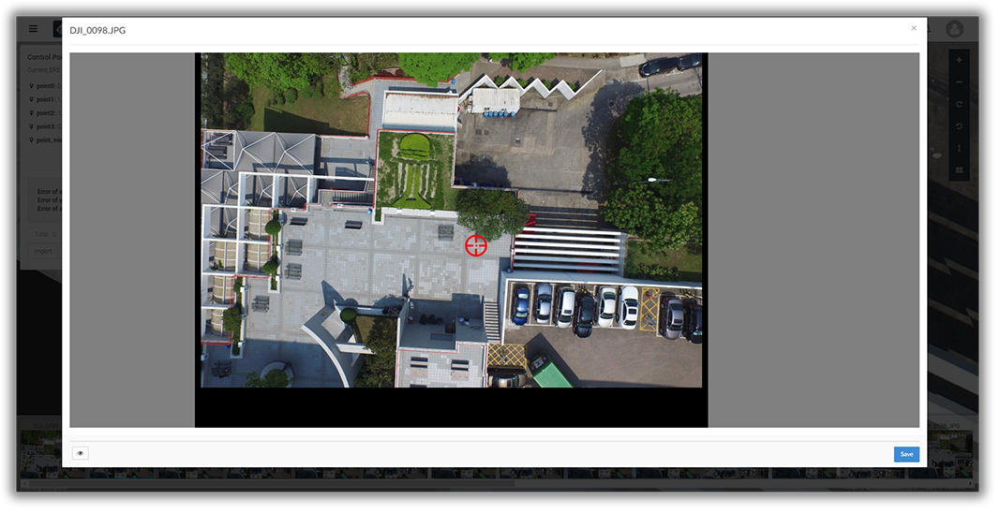  
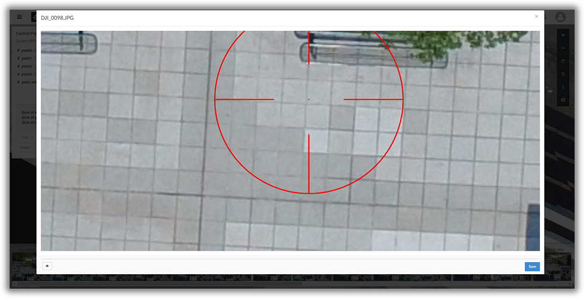  
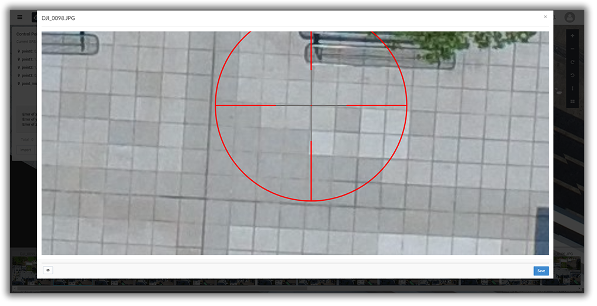

**小提示：**在标示的页面上，会看见一个眼睛的按钮，点击按钮会显示或关闭系统估算出来的位置，此为绿色准星表示，可作为参考。**用户标识的红色准星的位置，是最终输入系统的位置。**

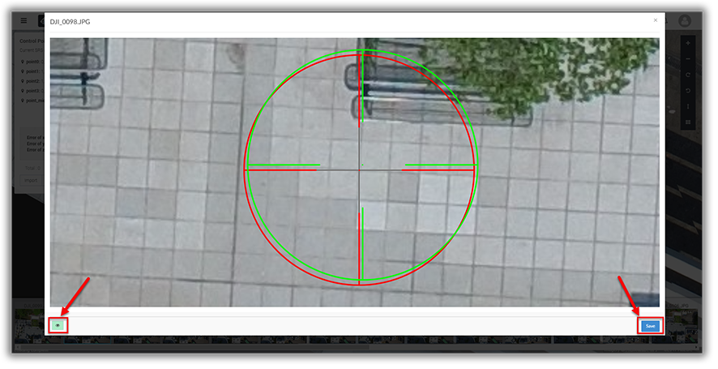

第十二步：为评估控制点校准的运算，用户可自行选择一些控制点作为校验点。**校验点本身不会参与校准的运算，但亦需要标示5-7张照片。请不要选择在模型边缘的控制点作为较准点。**当控制点校准完成后，我们的系统会运算出校验点的位置，然后跟他们测量的实际位置作比较，作为评估。

**请注意：请确保减去校验点后有最少三个控制点，用作控制点校准的输入。**

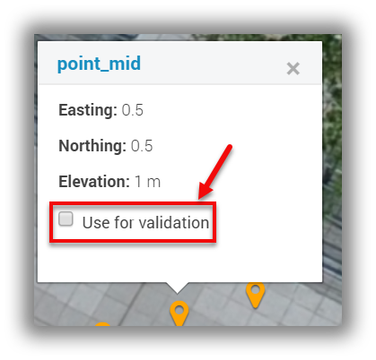

第十三步：标识完后，关闭GCP编辑器页面，点“初步校准”开始校准。

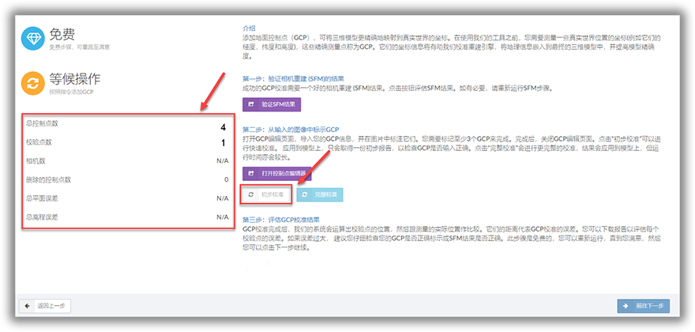

第十四步：初步校准后，请仔细阅读初步校准报告，判断校准结果是否可以接受。否则，请检查输入的控制点是否正确，然后重新校准，直至满意。  

第十五步：为了便于用户之后修改数据，建议导出标识完后的控制点数据。导出来的.json文件可作为历史数据储存起来。

第十六步：若报告结果满意，请点击 **完成校准**，并按 **前往下一步** 完成余下的操作。

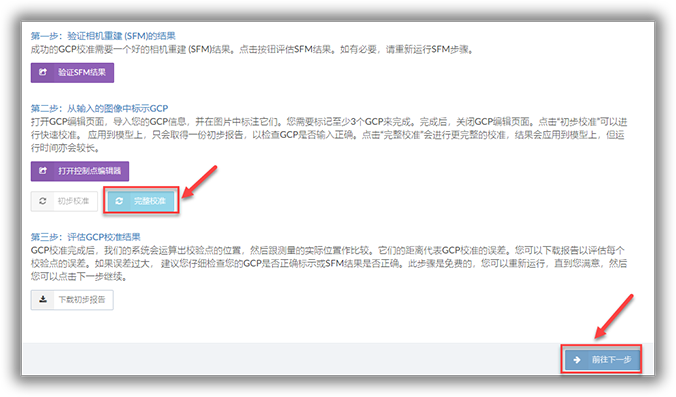

## 注意事项

1. 选取控制点时，要足够醒目，需要能在航拍图片上看得到。
2. 为了能更好地确定控制点坐标的三维位置，我们建议用户选择从不同角度拍摄的照片，在上面标示位置。
3. 每个GCP标示5-7张照片，而每张照片上，GCP所处的位置，最好在靠近照片中心点的位置。标示的位置大致如下图所示：

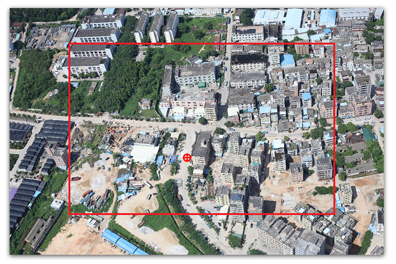

---

该文档最后修改于 {{ file.mtime }}
