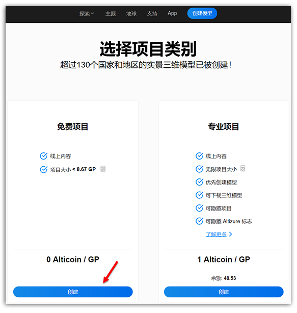
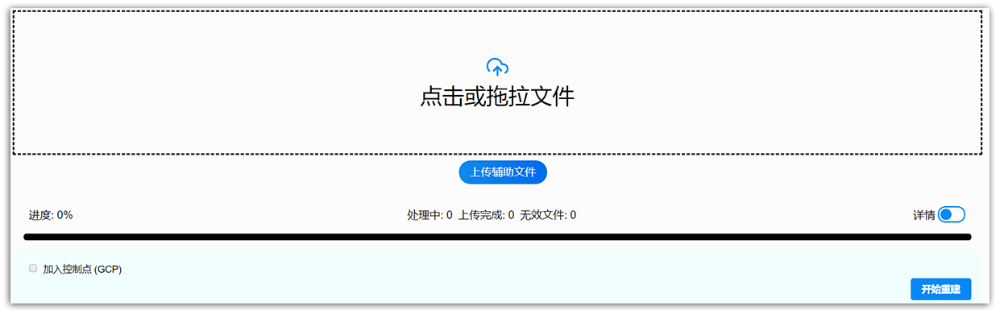
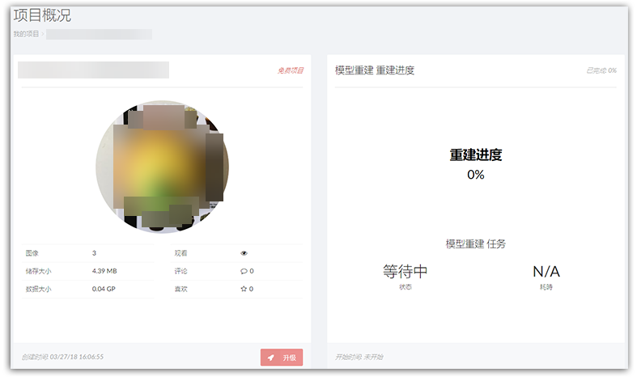

# 如何创建一个三维模型项目？

创建一个3D项目，总的说来，有**三步**：

**第一步：** 登陆您的Altizure账户。若您还没有Altizure账户，请看 [**这里**](register.md)。
  
  之后，点击顶部菜单栏的 **创建模型**。

**方法一：**

**方法二：**

**第二步：**上传图像到Altizure.cn

您可以选择创建一个免费或专业/收费项目。对于免费项目和专业项目的区别，请看[这里](https://site.altizure.cn/pricing)。不过，对于新手来讲，请选择 **免费项目**。

点击上传，或直接拖曳图片到下方的方框里。至于上传图像的要求，请看 [图像要求](image-requirements.md) 一章。

**第三步：**点击 **开始重建** 按钮，开始三维重建过程。 

如果您成功开始您的项目，那么您会被自动带到 **项目概况** 页面，且 **项目概况** 页面上会显示您的 **模型重建进度** 信息为 **等待中**。
否则，请您在 **项目概况** 页面的 **执行任务** 卡中，重新启动您的项目。

---

本文档最后修改于 {{ file.mtime }}
