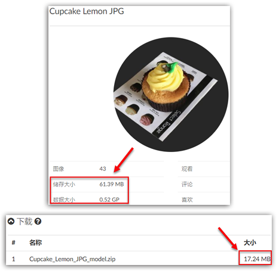

# 数据大小、储存大小、模型大小

在**项目概况**页面，我们可以看到**储存大小**（Storage Size）、**数据大小**（Data Size）和**模型文件的大小**（Model Size）。那么，这三个数据分别是什么意思呢？

在本文的范例中，我们建立了两个项目，一个项目是用43张JPG照片建立的，另一个则是用43张PNG照片。两组照片的照片内容完全一样，但格式不同。

* [这三个数据在哪里？](#wheretofind)

* [数据大小（Data Size）](#data)

* [存储大小（Storage Size）](#storage)

* [模型文件的大小（Model Size）](#model)

## 这三个数据在哪里？ {#wheretofind}

您可以在**项目概况**页面的项目信息卡中，看到**储存大小**和**数据大小**。

若想看**模型文件的大小**，则可以在**项目概况**页面 &gt;&gt;**下载**卡 中，找到这个数据。

## 数据大小（Data Size） {#data}

**数据大小**（单位：像素pixel）：指用户上传照片的总像素大小。我们机器的运算量是由像素大小决定的，而我们的[价格](https://site.altizure.cn/pricing)则是由机器的运算量决定的。

在本范例中，我们可以看到，PNG和JPG图片有不同的_文件大小_。如上图所示，DJI\_001的PNG文件大小是34.9MB，而JPG文件大小则只有1.48MB。这意味着，所有PNG图片的总文件大小会比JPG大很多。而事实上，情况也是如此，总PNG文件大小是1.46GB，而JPG则只有61.3MB。

不过，当我们看每张图片的分辨率时，我们会发现，不论每张图片的文件大小有多么不同，它的像素是保持不变的，即：3024 x 4032 像素。

所以，当我们分别上传完JPG和PNG图片后，我们会发现，两个项目的总像素大小（即**数据大小**）是一样的，都是 3024 x 4032 x 43 = 524289024 pixels ≈ 0.52 GP（GP=十亿像素）（如上图所示）。

这说明，不论图片格式是什么，它的像素大小是一样的。

## 存储大小（Storage Size） {#storage}

**存储大小**（单位：字节bytes，如 KB MB GB 等）：存储大小是您上传的照片，经过某种算法压缩后，储存在我们电脑中所占用的空间。压缩后，每张图片的像素大小仍不变。

范例中，JPG项目的存储量大小为61.39 MB，即存储在我们电脑中所占用的空间是61.39MB。而PNG则是1.47GB。由此可知，存储量大小是由不同图片格式的_文件大小_决定的，而储存PNG图片时，需要更多的存储空间。

## 模型文件的大小（Model Size） {#model}

**模型大小**（单位：字节bytes）：Altizure生成的模型文件的大小，也就是Altizure提供的OBJ模型下载文件的大小。

下图显示，JPG项目模型的OBJ文件大小为17.24MB，而PNG项目的模型文件大小则是21.91MB。这说明，上传图片的图片格式和其总的图片文件大小会影响Altizure生成的模型文件的大小。

---

该文档最后修改于 {{ file.mtime }}