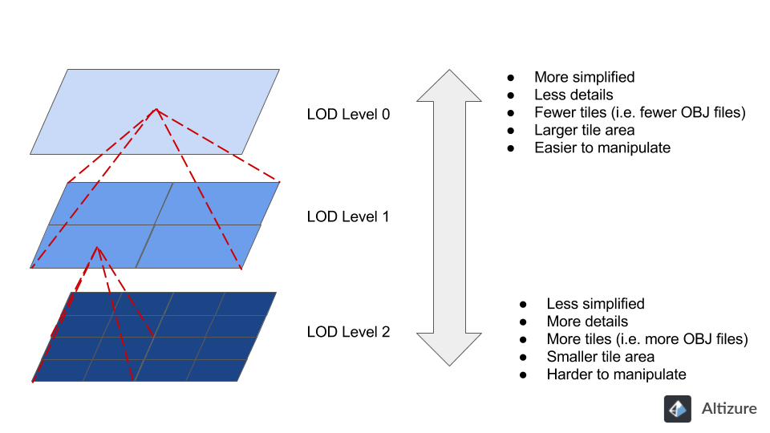
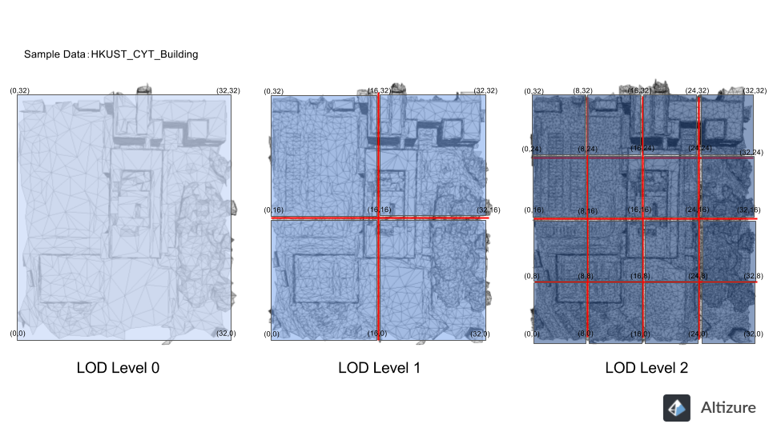
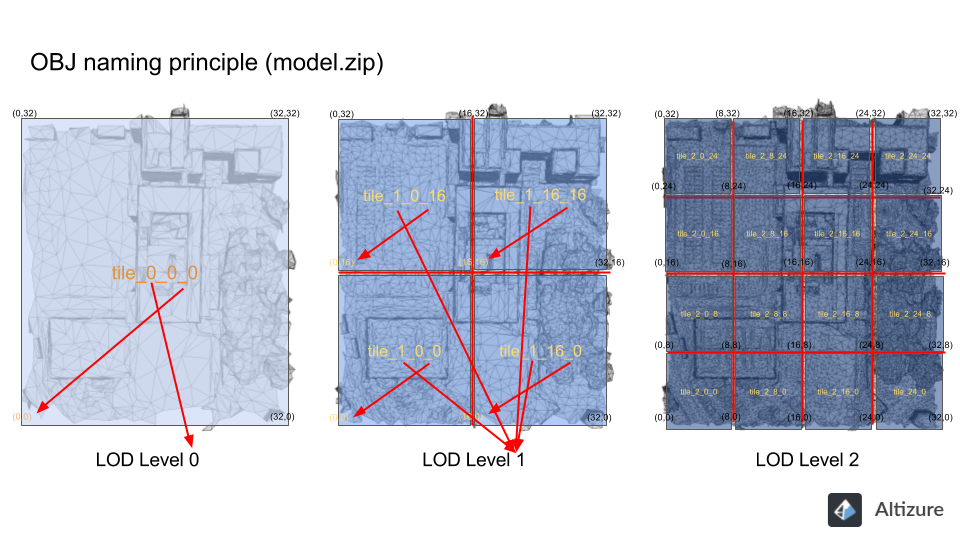

# 在Altizure下载模型文件

**只有专业项目的用户才可以下载模型文件。**您可以将您的免费项目升级为专业项目。

Altizure会提供OBJ格式的模型文件，供用户下载。您也可以通过[Altizure桌面版](https://www.altizure.cn/download) 的转换器，将下载的OBJ文件，转成其他不同的格式（ [转换器使用教程](offline-format-converter.md)）。

这些格式包括鸟瞰图/正射图、高程图、合并的OBJ文件、谷歌地球三维模型文件、PLY、OSGB、KML、DAE、STL文件等。其中，鸟瞰图/正射图、高程图、OBJ文件、谷歌地球三维模型文件的样例文件，可在此页面的底部，[样例数据](#sample) 下载。

* [model.zip解压后，里面有很多OBJ文件，这是为什么？哪个才是我的模型？](#lots)
* [每个OBJ文件是代表模型哪一个精度层次，哪一个片块？](#lod)
* [OBJ 文件浏览器](#viewer)
* [为什么我的项目里的下载作品内容和这个页面提到的不太一样？](#different)
* [Altizure 3D模型样例数据](#sample)

## model.zip 解压后，里面有很多OBJ文件，这是为什么？哪个才是我的模型？ {#lots}

我们的三维重建系统能生成高精度的三维模型，但高精度模型意味着庞大的数据量，不利于各种应用，如数据传输，模型渲染，模型编辑等等。对配置较低的电脑是非常吃力。 为此，我们使用了**细节分层（Level-of-detail，LOD）**的技术处理三维模型，把重建好的模型进行简化，分拆，制作成不同精度层次的模型**片块（tile）**，并以**四叉树（quadtree）**的结构组织。好处是能应付巨大的模型，用户亦可以按不同的需要，使用不同精度的模型。

四叉树结构概念图（quadtree structure）：

四叉树例子：

 

**因此，model.zip里的每个OBJ是您的模型在不同的层次，不同的片块。**把同一层次的所有片块加载后就能得出整个模型。

## 每个OBJ文件是代表模型哪一个精度层次，哪一个片块？ {#lod}

每个OBJ文件的名称都有三个数字。例如：`tile_1_0_16.obj`。

第一个数字（e.g. 1）代表模型的精度层次，数字愈小，模型愈简化。

第二和第三个数字（e.g. 0, 16）代表该部分在整个模型的位置的xy座标。

看下图参考：

由于模型片块之间以四叉树的结构组织，精度每高一级，片块的数量便增加 4 倍，片块的面积便相应地缩减 4 倍，边长便缩减 2 倍。因此，名称的第二和第三个数字的间距亦相应地缩减 2 倍。如此类推，直至精度最高的一层，模型便不再细分。此时我们把片块的边长定义为 1 个单位，因此文件名称的xy座标间距亦为 1 个单位。

以我们的样板数据 HKUST_CYT_Building 为例。模型最高精度层次为 5，因此该层在 x 轴和 y 轴方向各有 2^5 = 32 个边长为 1 单位的片块。所以整个模型便是 32 乘 32 个单位大。

在LOD level 5 时，精度最高，片块边长定义为 **1** 个单位，所以：
`tile_5_1_0.obj`的右边是`tile_5_0_0.obj`. ，x 座标值便跳了 **1** 个单位；
`tile_5_0_0.obj`的上边是`tile_5_0_1.obj` ，y 座标值便跳了** 1** 个单位。

在LOD level 4 时，片块边长为 **2** 个单位，所以
`tile_4_0_0.obj` 的右边是`tile_4_2_0.obj` ，x 座标值便跳了 **2** 个单位；
`tile_4_0_0.obj` 的上边是`tile_4_0_2.obj` ，y 座标值便跳了** 2** 个单位。

在LOD level 3 时，片块边长为 **4** 个单位，所以
`tile_3_0_0.obj` 的右边是`tile_3_4_0.obj` ，x 座标值便跳了 **4** 个单位；
`tile_3_0_0.obj` 的上边是`tile_3_0_4.obj` ，y 座标值便跳了** 4** 个单位。

在LOD level 2 时，片块边长为 **8** 个单位，所以
`tile_2_0_0.obj` 的右边是`tile_2_8_0.obj` ，x 座标值便跳了 **8** 个单位；
`tile_2_0_0.obj` 的上边是`tile_2_0_8.obj` ，y 座标值便跳了** 8** 个单位。

在LOD level 1 时，片块边长为 **16** 个单位，所以
`tile_1_0_0.obj` 的右边是`tile_1_16_0.obj` ，x 座标值便跳了 **16** 个单位；
`tile_1_0_0.obj` 的上边是`tile_1_0_16.obj` ，y 座标值便跳了** 16** 个单位。

在 LOD level 0 时，片块边长为 **32** 个单位，只有一个片块便覆盖了整个模型，所以只有一个 `tile_0_0_0.obj` 的文件。

## 如何浏览OBJ 文件？ {#viewer}

可导入 OBJ 模型的**免费**软件：

1. Autodesk FBX Review: [产品页面](http://www.autodesk.com/products/fbx/fbx-review)

可导入 OBJ 模型的**专业**软件：

1. Adob​​​​​​e Photoshop: [产品页面](https://www.adobe.com/products/photoshop.md)
1. Autodesk 3Ds Max: [产品页面](https://www.autodesk.com/products/3ds-max/overview)
1. Autodesk Maya: [产品页面](http://www.autodesk.com/products/maya/overview)
1. Blender (开源免费软件): [产品页面](https://www.blender.org/)
1. Unity: [产品页面](https://store.unity.com/?_ga=1.1178609.1753436748.1473386856)

以上不完全列表仅供参考。

## 为什么我的项目里的下载作品内容和这个页面提到的不太一样？ {#different}

因为我们在不停更新我们的后台服务以提供越来越丰富的内容以供用户使用，所以如果您的项目是较早时候重建的，项目的下载内容可能未能包括最新的升级内容。不必担心，请您通过项目概况页面的 **报告问题**按钮联系我们，我们会检查您的项目，并为您免费升级到最新版本。

## 样例数据 {#sample}

以上解释用到的例子来自于样例 [HKUST_CYT_Building](https://www.altizure.cn/project/5a08601a5d1dfe17d0c76ab1/model)，您可以自由免费地下载和使用这个数据。  如有任何问题，欢迎在论坛上提问或者联系 support@altizure.com.

在线互动三维：

<iframe src="https://site.altizure.cn/project/590c784c1225725be9d360db/model/embed#autoplay=false" style="border:none;width:640px;height:480px"></iframe>

Altizure提供的下载文件：
* 三维模型（model.zip）： [百度云盘](https://pan.baidu.com/s/1bqL3v7h)

用户可使用[Altizure离线格式转换器](https://site.altizure.cn/support/articles/format_conversion?lang=zh-cn)，转成的格式包括：
* 鸟瞰图（ortho.zip）: [百度云盘](https://pan.baidu.com/s/1o8VGdNs)
* 高程图（ortho_dsm.zip）: [百度云盘](https://pan.baidu.com/s/1smGXd29)
* 三维模型（merged_model.zip）：[百度云盘](https://pan.baidu.com/s/1i6WM00t)
* 谷歌地球三维模型（model.kmz）： [百度云盘](https://pan.baidu.com/s/1gg7OaRp)

---

本文档最后修改于 {{ file.mtime }}

