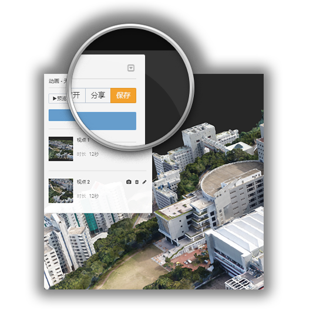

# 飞行动画

Altizure**虚拟飞行动画**，让用户可从原本需要精准飞行控制的角度，向客户或朋友全方位展示模型。

对于任何一个项目，目前只有**项目所有者**才可以创建那个项目的飞行动画。

* [什么是飞行动画？](#what)
* [创建飞行动画](#how)
* [编辑飞行动画](#edit)
* [为同一个项目创建多个飞行动画](#several)
* [分享动画](#share)

## 什么是飞行动画？ {#what} 
3D模型建好后，用户可有多种玩法。您可以编辑模型，制作飞行动画，对用户进行展示，或向朋友全方位无死角炫模型。简单来讲，制作飞行动画就是选取自己满意的角度，点击
 **添加视点** 添加关键帧，系统会自动生成关键帧之间的动画。于是，通过以上简单几步，一部飞行动画就成型了。

飞行动画由3D浏览器自动生成，与浏览器无缝融合。在为用户提供可供回放的视频和3D交互式探索的同时，它也为观者进行了一种3D模型导览。

通过预设动画，

* **创作者**可将自己3D作品最好的一面呈现给观众。
* **电影制作者**能在现场拍摄前，将相机运动“可视化”，更直观地进行拍摄规划。
* **无人机操控员**可进行模拟飞行，调整航道，更好地规划拍摄航线。

目前，高清动画正在研发中，我们会在公众平台公布我们的最新进展。

## 创建飞行动画 {#how}

视频教程：
<iframe frameborder="0" width="640" height="498" src="https://v.qq.com/iframe/player.html?vid=o0379a8thlu&tiny=0&auto=0" wideth="640" height="480"></iframe>

1. 在项目列表页面，打开任一项目
2. 点击左侧边栏的 **模型工坊** 分页
3. 在工具栏中点击 **飞行动画** 按钮激活飞行动画
4. 将模型移动或旋转到自己满意的任一角度，点击 **添加视点** 将当前的视角保存下来。重复这一步骤，将您想要纳入动画的视点都添加进来。每个视点会成为动画中的一个关键帧。
5. 点击 **预览** 可以播放现有的动画。
6. 您可以编辑、删除、拖动任意一个视点，或加入新的视点，直到您对软件生成的动画满意为止。
7. 点击 **保存** 按钮保存结果。

您可以**随时编辑**您之前创建的动画

## 编辑已创建好的动画 {edit}

* 您可以通过以下功能编辑动画：
  在动画中添加新视点，删除您不想要的视点，或将视点重新排列组合

* 您也可以编辑两个视点之间的时长

## 为同一个项目创建多个飞行动画  {#several}

可以。点击动画卡片中的 **打开** 按钮，开启当前项目中所有动画的列表。在这里，您可以打开、重命名、删除其中任何一个动画，或创建一个新动画。

## 如何分享动画结果？  {#share}
非常简单。如果您创建的动画还未保存，您可以先点击动画卡片中的 **保存** ，再点 **分享** 按钮，即获得当前动画的链接，您可以把这个链接发给您的同事或者朋友，或直接分享到各大社交网站。

我们一共有四种分享方式：
1. 获取直接链接
2. 直接分享到各社交平台。目前支持的平台有：新浪微博，Facebook，Twitter，Google Plus 和Pinterest

3. 分享二维码

4. 第四种方法是，通过获取嵌入代码，把您制作的动画嵌入到您的网页里。

嵌入的动画将如下图所示：

<iframe src="https://www.altizure.cn/project/564c5f5afa3d3c1939de100f/model/embed?flight=56e6bb82fc79409e61fdef68#autoplay=false" style="border:none;width:640px;height:480px;max-width:100%;"></iframe>

--- 

本文档最后修改于 {{ file.mtime }}