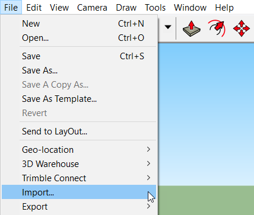
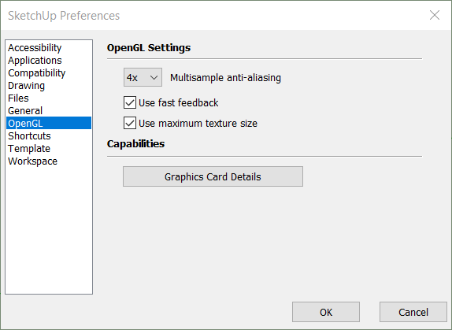
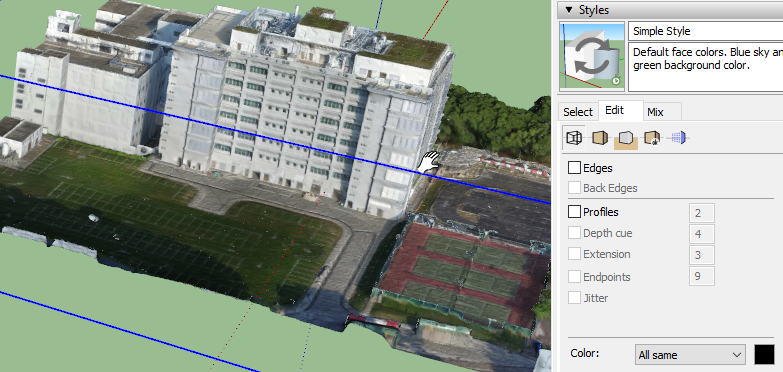
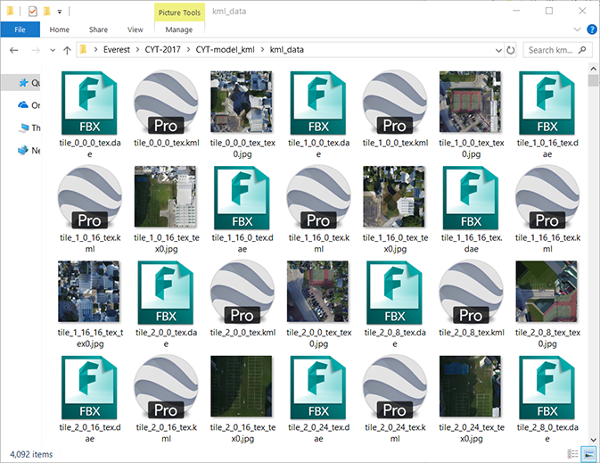
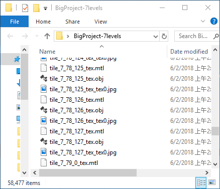
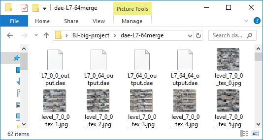
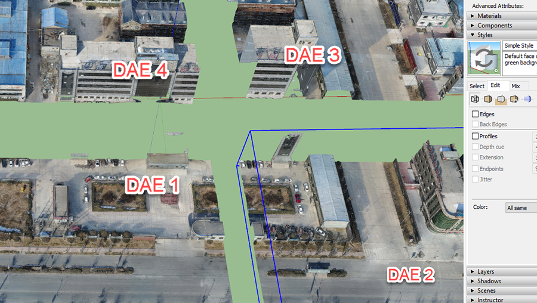

# 如何将Altizure模型文件导入SketchUp？

* [导入SketchUp需要哪些工具](#need)
* [如何将Altizure DAE文件导入SketchUp](#full-dae)
* [通过“整个项目的OBJ模型转换 > kml”的方式得到DAE，如何](#full-kml)
* [SketchUp加载/渲染DAE很慢](#slow)
* [如何将高精度模型导入SketchUp](#high-lod)

## 导入SketchUp 需要哪些工具？ {#need}

1. 可在[Altizure 桌面版](https://www.altizure.cn/desktop)中，下载离线格式转换器。
   * [格式转化器使用方法](https://kitty_ji.gitbooks.io/eng-altizure-reconstruction-guide/content/offline-format-converter.md)
2. SketchUp [下载链接](https://www.sketchup.com/)
3. [样例模型文件](https://kitty_ji.gitbooks.io/eng-altizure-reconstruction-guide/content/downloadable-assets.md#sample)

## 如何将Altizure DAE文件导入SketchUp？ {#full-dae}

以下是一个短小的教学视频：

<iframe frameborder="0" width="640" height="498" src="https://v.qq.com/iframe/player.html?vid=f0560q15yit&tiny=0&auto=0" width="640" height="480"></iframe>

**第一步：** 为了不让转换出来的DAE文件零散，我们要先合并文件。在Altizure格式转换器中，"整个项目的OBJ模型转换 > merge"，合并下载的OBJ文件（model.zip）。 合并后的模型文件是每一层级一个OBJ文件。用户可根据电脑硬件条件，选择接下来要转换的OBJ文件。**（有关模型文件不同的纹理层级的概念）** 插入链接

**请注意：** JPG是模型的纹理贴图。不论您将模型转成哪种格式，JPG贴图必须永远和其他模型文件在同一文件夹里，这样模型才能正常显示纹理贴图。

**第二步：“单个OBJ文件转换 > dae”。**选择其中一个层级的OBJ文件，转换成DAE。这里，我们使用的电脑显卡是 GTX 980，能加载范例模型中的最高层级文件，level5。

**请注意：** 转换后DAE文件夹包含JPG和DAE两种格式。两种格式的文件必须在同一文件夹里，这样，DAE在导入SketchUp后，才能正常显示模型。

**第三步：**打开SketchUp。点击 **File > Import**，导入DAE文件。

**第四步：**.dae文件加载完成后，您会发现默认的渲染选项，并非将模型的最高层级纹理渲染出来。SketchUp会自动将纹理降到1024 x 1024像素。如果您需要提高纹理分辨率，对于Windows用户，请点击顶部工具栏的 **Window > Preferences > OpenGL**，勾选 **Use maximum texture size** 并点击 **OK** 保存。如果您是macOS系统，请在 **Properties > OpenGL** 中，勾选 **Use maximum texture size**。

**请注意：**勾选这个设置可以保证SketchUp在实时渲染时使用 Altizure 生成的高精度的纹理，**但如果您的显卡性能不足，可取消该选项加快实时渲染速度**。

**第五步：**DAE文件加载完毕后，若想更清晰地显示模型纹理贴图，可在右侧工具栏，**Style > Edit > Edge Settings**，取消**Edges**, **Back Edges**, **Profiles**的勾选。

##  请问我可以通过 整个项目的OBJ模型转换 > kml 的方式得到dae文件吗？ {#full-kml}

在Altizure桌面版里，若采用 "整个项目的OBJ模型转换 > kml" 的方式，实际输出的文件，包含可以导入SketchUp的DAE文件。（以下是通过此种方法转换后的文件夹截图） 从图中可知，这个方法有个弊端，由于输入的OBJ文件零散，转换出来的DAE文件，也是零散的。所以，我们还是建议用户使用[上面的方法](#full-dae)。

## 为什么我的DAE加载进去，渲染很慢？ {#slow}

这是由于您的显卡性能不足。经测试，NVIDIA GTX 980可以流畅加载level 6的DAE模型。如需加载更高精度的模型，请确保显卡的渲染性能达到要求。

## 如何将高精度模型导入SketchUp？ {#high-lod}

有关如何使用格式转换器合并OBJ文件并设置相关数值，请看这里。**Add Link**

用户可在合并时，将模块尺寸设置成最大值64。合并后的最高层级模型文件会被拆分成几个OBJ文件。用户可在SketchUp上加载这几个文件，并将他们拼合在一起。以下图案例中的模型为例，具体步骤可归纳如下：

**第一步：**此模型最高层级为level 7，level 7模型由128x128个tiles片块组成（即：2^(6+1)=128）。所以，当模块尺寸设为64时。合并后 level 7 有4个OBJ文件（ (128x128)/(64x64)=4）。

**第二步：**依次将这四个文件通过 **单个OBJ文件转换 > dae** 的方式，转换成DAE格式。请注意：转换时，4个文件要设置成不同的文件名，免得后面转换出的文件将前面的文件覆盖。

**第三步：**将DAE逐个导入SketchUp。经测试，NVIDIA GTX 980可加载level 7全部4个文件。用户可在SketchUp中将所有4个文件拼合在一起。

---

本文档最后修改于 {{ file.mtime }}
