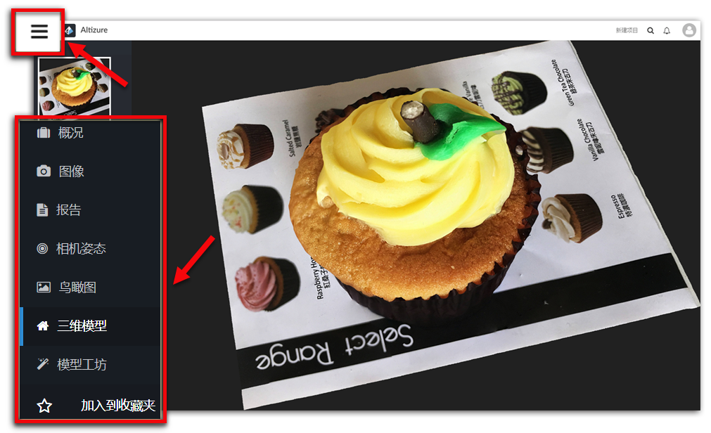
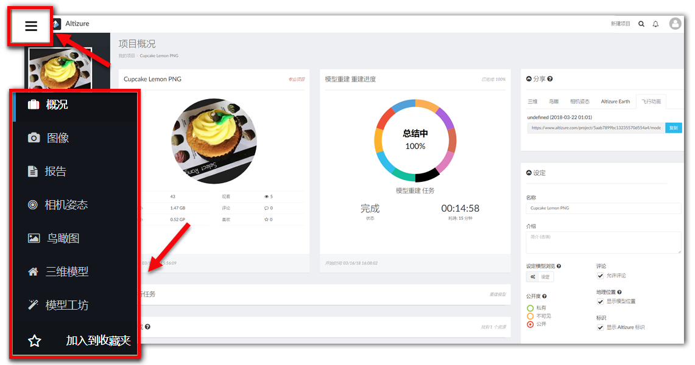

# 左侧菜单栏 {#left}

## 如何打开左侧菜单栏？ {#left-enter}
只要您登陆的页面左上方有个 **三条横线的按钮**，您就可以点击按钮，打开 **左侧菜单栏**。

## 左侧菜单栏的内容 {#left-content}

### 项目概况页面 {#overview}

[**项目概况页面**](overview-page.md#overview) 的入口。您可以在这个页面管理您的项目。

### 图像页面 {#images}
您可以在此页面查看您所有上传的图像。不论是重建过程中，被判断为“有效”或“无效”的照片，您都可以看得到。

### 报告页面 {#report}
点击此按钮，可查看三维重建报告。报告包括，相机预测，GPS定位，图像覆盖报告图等。同时，报告也包含对每张输入图像的数据分析，这包括，每张图像的三维点数量、reprojection error等。这可以帮助用户，检查哪些图片在三维重建过程中，作用最大，哪个地区图像覆盖不够，或重建效果不好，还需要再提高，等等。

更多有关如何解读三维重建报告的内容，请看这篇 [这篇文章](3d-reconstruction-report.md).

### 相机姿态页面 {#camera}
它可视化了稀疏点云和相机姿态，帮助您评估本次飞行计划。您可以根据这些数据，判断推测您当时的飞行路径，拍照模式，飞行的高度和角度，以及哪些地区图像覆盖率不够，等等。

### 鸟瞰图页面 {#ortho}
您可以在此查看不同细节程度的二维鸟瞰图。

### 三维模型页面 {#3d}
所有用户或访问者都可在此查看三维模型。除了实时显示，用户还可以在此进行评论或将模型分享到其他社交平台。

### 模型工坊页面 {#studio}
[**模型工坊页面**](studio-page.md) 的入口。

--- 

本文档最后修改于 {{ file.mtime }}

