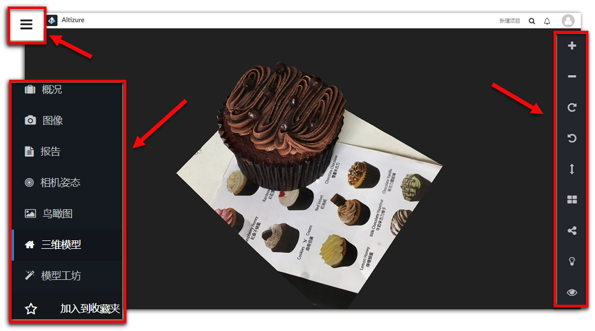
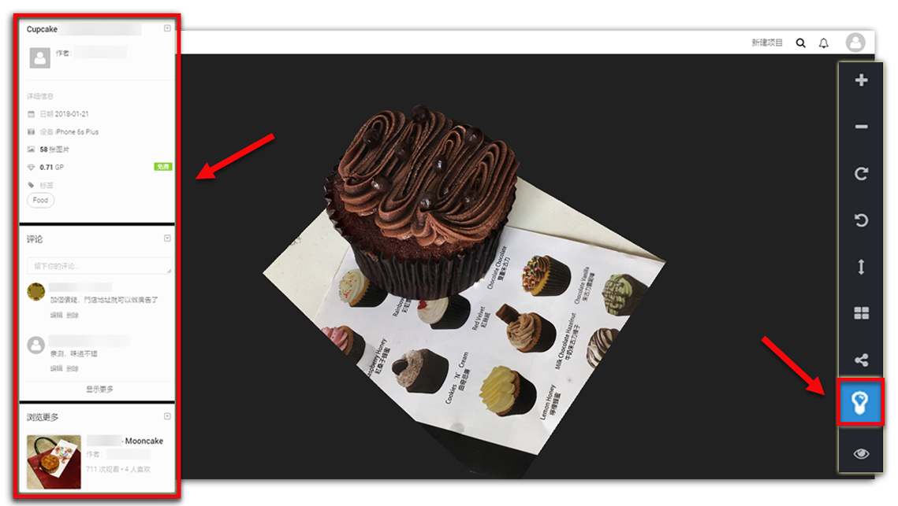

# 三维模型页面 {#model}

所有网站访问者都可以看到 **三维模型页面**，而不仅是项目所有者。这说明，所有人都可以使用这个页面上的功能。

* [如何进入三维模型页面](#enter)
* [模型浏览工具](#viewingangle)
* [分享按钮](#share)
* [开/关灯按钮](#light)
* [浏览模式按钮](#mode)

## 如何进入三维模型页面 {#enter}

打开[**左侧菜单栏**](left-sidebar.md)，点击 [**三维模型**]。这时候，您就可以进入**三维模型页面**。

## 模型浏览工具 {#viewingangle}

[模型工坊页面](studio-page.md#viewingangle)也有同样功能。

## 分享按钮 {#share}

您可以将模型分享给您的同事或亲朋好友。

## 开/关灯按钮 {#light}

您可以在此查看项目信息，留言或浏览其他用户的评论。除此以外，在 **浏览更多** 卡片，您可以找到由此用户或其他用户做出的其他同类型的模型。

## 浏览模式按钮 {#mode}

系统默认的浏览模式是 **纹理**。您也可以查看模型的 **网格** 和 **表面**模式。

**模型工坊页面** 也有同样功能。

**纹理浏览模式：**

**表面浏览模式：**

**网格浏览模式：**

--- 

本文档最后修改于 {{ file.mtime }}

