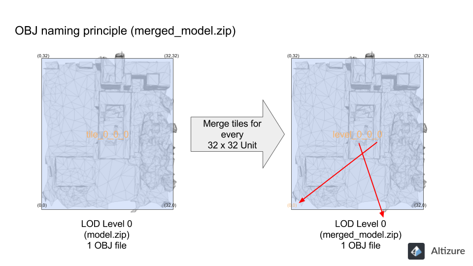

# 如何使用Altizure离线格式转换器?

为满足不同用户对模型文件的格式需求，Altizure团队开发离线格式转换器。通过Altizure格式转换器，用户能快速流畅地将下载的模型文件，转换成自己所需的格式 \(.osgb .dae .stl .kml .ply\)。

* [支持平台](#platforms)
* [面向的用户群体](#who)
* [如何获取转换器](#where)
* [可以转换成的格式](#formats)
* [Altizure 格式转换器功能介绍](#features) 
  * [输入路径和输出路径](#paths)
  * [项目obj模型转换](#full)
    * [OSGB](#fullosgb) & [Orthomap](#fullortho) & [Merge合并文件](#fullmerge) & [KML](#fullkml)
  * [单个 OBJ模型转换](#single)
    * [OSGB](#singleosgb) & [DAE](#singledae) & [KML](#singlekml) & [STL](#singlestl) & [PLY](#singleply)
* [可以在哪里下载OBJ文件](#download)
* [如何处理 d3dcompiler\_47.dll 错误](#error)
* [教程短片](#video)

## 支持平台 {#platforms}

* Windows 64位
* macOS

## Altizure 格式转换器面向的用户群体 {#who}

需要将模型文件导入第三方软件进行再开发，或对格式有特定需求的用户，如测绘行业、动画、CAD专业人士等。 

## 如何获取转换器？ {#where}

您可以下载 [Altizure 桌面版](https://www.altizure.cn/desktop) \(Windows 64位 和 macOS\)，转换器入口如下图所示：

## 可以转换成的格式 {#formats}

目前转换器支持.obj文件转成以下几种格式：

* **PLY 文件：** 多边形档案格式（全称： Polygon File Format）。我们用此格式存储点云数据，包含其三维坐标、法向量和颜色信息。

* **OSGB 文件：**开源osg模型格式（全称： Open Scene Gragh Binary）。osgb格式为二进制存贮、带有嵌入式链接纹理数据（.jpg）。该文件格式在摄影测量界被广泛使用。

* **DAE 文件：**又称COLLADA (COLLAborative Design Activity)，是一种常用的三维模型格式。文件内部用XML结构组织三维模型的信息。

* **KML 文件：**是一种包含地理信息的三维模型格式，可导入Google Earth。

* **STL 文件：**是一种描绘三维物体几何信息的格式，该格式不支持颜色材质等信息。它是三维打印机支持的最常见文件格式。

## Altizure 格式转换器功能介绍 {#features}

### 输入路径和输出路径 {#paths}

对于 **"项目obj模型转换"** ，**输入路径** 应该是用户储存所有OBJ文件的文件夹。一般来讲，输入文件夹是用户直接从Alizure下载下来，对model.zip解压过后的模型文件夹。而至于**输出路径**，是转换后，输出文件的文件夹。输出文件夹可以是已建立的或还未建立的文件夹。用户在选好路径后，可直接在输出路径上，打上自己想建立的文件夹名字，这样，系统会在输出文件时，自动生成这个新的文件夹。

换句话讲，对于 **"项目obj模型转换"**，输入和输出路径的结尾，应该都是文件夹名，而非文件名。

**请注意：**Altizure格式转换器的输入和输出路径，暂不支持中英文混杂或中文。输入和输出路径中，所有的文件夹名请用全英文。

例子：对于 **项目obj模型转换 &gt; Orthomap**

假设，输入路径为 **C:\Users\Altizure\Desktop\CYT model-2017**

输出路径为 **C:\Users\Altizure\Desktop\CYT-Ortho**

这说明，**CYT model-2017 **是输入文件夹，或需要进行格式转换的文件夹。而 **CYT-Ortho** 则是输出文件夹。

不过，如果只要转换一个OBJ文件，那么在选择输入路径时，就应选择OBJ文件，而非存放OBJ文件的文件夹。对于 **输出路径**，选择输出文件夹后，系统会自动在输出路径上，显示一个输出文件的名字。用户也可以对输出文件名进行修改后，再点击 **OK**，开始转换。

例子：对于 **Single OBJ file &gt; DAE**

假设，输入路径为 **C:\Users\Altizure\Desktop\CYT model-2017\tile\_0\_0\_0\_tex.obj**

若用户选择输入文件夹是Desktop桌面，那么Altizure桌面版显示的输出路径就是 **C:\Users\Altizure\Desktop\output.dae**

这里，**C:\Users\Altizure\Desktop** 是您选择的输出文件夹路径，而 **output.dae** 是系统自动生成的输出文件名。您可以对输出文件名进行重新命名，比如，您可以将输出路径变成 **C:\Users\Altizure\Desktop\Sketchup-output-1.dae** 等。

### 转换方式：项目obj模型转换 {#full}

可将整个项目或多个.obj文件转换成： 

#### 格式选择：OSGB {#fullosgb}

#### 格式选择：Orthomap {#fullortho}

##### 最大分辨率 & 保持 原分辨率： {#max}

这两个选项紧密相关。最大分辨率 的意思是，输出图像的最大分辨率不能超过所设数值（默认值是16384）。设定这一限制的原因是，对于非常大的项目（如城市级项目），系统不可能将超大orthomap/DSM只输出到一个文件中。所以，在这种情况下，我们有两种选择：

第一种：我们可以降低orthomap/DSM的分辨率，将每个文件的分辨率控制在用户所设置的最大分辨率以内。换句话讲， 关闭保持原分辨率 选项，但维持最大分辨率默认值不变（或输入其他数值）。

第二种：保持原分辨率。软件在转换时，会自动将orthomap/DSM的原始文件分割成数个小文件。每个文件的大小都控制在最大分辨率以内。

##### 为什么最高的分辨率是16384？ {#16384}

在讲解为什么我们将最高分辨率设成16384之前，您需要先了解，**细节分层（Level-of-detail，LOD）**和纹理层级的概念。（请看 [文章1](https://kitty_ji.gitbooks.io/downloadable-assets#lots) & [(文章2)](https://kitty_ji.gitbooks.io/downloadable-assets#lod)）

Altizure生成的模型精度很高，如果只用一张俯视影像涵盖整个模型，该影像文件大小会变得非常大，不方便操作。因此，我们给定参数限制输出影像的最大分辨率。通常我们建议把最大分辨率设成16384，在该分辨率下，对于层级是level 5或以下的项目，可以生成单个文件原始分辨率的俯视影像。（单个模型片块分辨率为512，level 5有边长为32的片块数，即512x32=16384）

#### 格式选择：Merge {#fullmerge}

简而言之，**Merge**（合并文件）就是将数个OBJ小文件合成一个OBJ大文件，便于用户进行浏览、编辑或修改。

在讲解 **Merge** 文件合并功能前，我们要先了解下，[四叉树结构（quadtree structure）](https://kitty_ji.gitbooks.io/eng-altizure-reconstruction-guide/content/downloadable-assets.md#lots) 和 [model.zip里OBJ文件命名规律](https://kitty_ji.gitbooks.io/eng-altizure-reconstruction-guide/content/downloadable-assets.md#lod).

如果您将 **模块尺寸** 设成32（即，默认模块尺寸），格式转换器就会将model.zip中的OBJ文件，以每 32 乘 32 个单位缝接（merge）起来。您可以把这些 OBJ 理解为面积较大的片块。目的是方便用户操作，不用每次加载一大堆零碎的 OBJ 文件。

##### 模块尺寸最大可设成多少？

在看完有关 [四叉树结构（quadtree structure）](https://kitty_ji.gitbooks.io/eng-altizure-reconstruction-guide/content/downloadable-assets.md#lots) and [细节分层（Level-of-detail，LOD）](https://kitty_ji.gitbooks.io/eng-altizure-reconstruction-guide/content/downloadable-assets.md#lod),的文章后，您现在应该理解了，从Altizure上下载的OBJ文件，一般表示为：tile_l_x_y，其中l为模型的层级。第二和第三个数字（e.g. x, y）代表该部分在整个模型的位置的xy座标。

在l级，它的x和y坐标的最大值不超过2^(l+1)。例如：某项目最高层级为level 5，其x和y的坐标数值不超过64 （2^(5+1)=64）。此时，如果想把level 5的所有模型合并成一整块，合并的模块尺寸可设置成64即可。经测试，64的模块尺寸也是目前普通电脑所能承受的最大模块尺寸。

**请注意：**由于电脑内存有限，不是所有层次的模型都可以合并成一个OBJ。我们不建议使用模块尺寸超过64的设定。另外，为了均匀拆分模型文件，不论您的模型文件有几个level，模块尺寸都一般设置为2的幂数。

##### 如何对高精度OBJ模型进行合并? {#high}

对于纹理层级为6（level 6）甚至更高的模型，用户可在合并时，将模块尺寸设置成最大值64。经测试，64的模块尺寸也是目前普通电脑所能承受的最大模块尺寸。

举例来讲，对于纹理层级为7的模型（level 7），level 7模型由128x128个tiles片块组成（即：2^(6+1)=128）。所以，当模块尺寸设为64时。合并后 level 7 有4个OBJ文件（ (128x128)/(64x64)=4）。

#### 格式选择：KML {#fullkml}

### 转换方式：单个 OBJ模型转换 {#single}

单个OBJ文件可以被转换成： 

#### 格式选择：OSGB {#singleosgb}

#### 格式选择：DAE {#singledae}

#### 格式选择：KML {#singlekml}

#### 格式选择：STL {#singlestl}

#### 格式选择：PLY {#singleply}

## 可以在哪里下载OBJ文件？ {#download}

通过将自己的项目升级到专业项目（用户需要购买Alticoins），用户可以下载 **&lt;projectname&gt;\_model.zip**。 [（样例文件）](https://kitty_ji.gitbooks.io/eng-altizure-reconstruction-guide/content/downloadable-assets.md#sample)

## 在 win7 安装新版Altizure桌面版时，遇到 d3dcompiler_47.dll 丢失导致无法安装。 {#error}

请前往 [微软官方网站](https://www.catalog.update.microsoft.com/Search.aspx?q=kb4019990) 下载 **kb4019990** 系统补丁。

## 教程短片 {#video}

<iframe frameborder="0" width="640" height="498" src="https://v.qq.com/iframe/player.html?vid=w0509szp07o&tiny=0&auto=0" width="640" height="480"></iframe>

--- 

本文档最后修改于 {{ file.mtime }}

