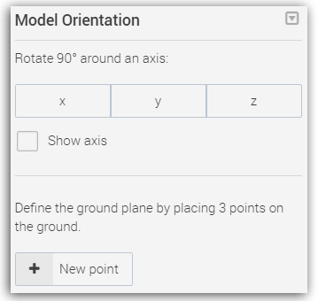

# 如何设定模型朝向？

## 在哪里设定模型朝向？ {#enter}

您需要先进入 [**项目设定页面**](setup-page.md#enter)，然后点击 **模型朝向** 按钮。

## 什么是模型朝向？ {#orientation}

有时候，如果图像并没有成功嵌入gps地理位置信息，那么系统很难判断，重建出来的模型是朝南还是朝北，是朝上还是朝下。这可能会导致，模型上下颠倒或没有朝向正确的方位。

这时候，我们就需要通过设定 **模型朝向** 告诉电脑，哪里是正确的方向。三点决定一个平面。所以，您可以在模型上，选取一个平面，在上面放置三个点。

## 视频教程 {#video}

<iframe frameborder="0" width="640" height="498" src="https://v.qq.com/iframe/player.html?vid=b0183up26k2&tiny=0&auto=0" width="640" height="480"></iframe>

--- 

本文档最后修改于 {{ file.mtime }}
