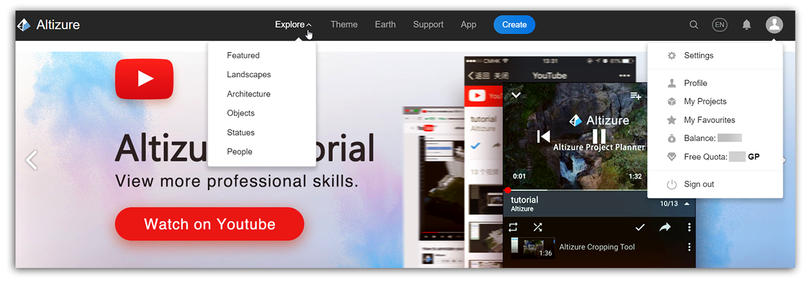

# 其他功能

## 左侧菜单栏

请看 [这里](left-sidebar.md)。

## 顶部菜单栏 {#top}

**探索页面：**探索页面按照用户指定的排序和筛选条件列出所有符合条件的公开项目，譬如用户可以指定浏览本月最受欢迎的项目。探索页也带有一个搜索栏。项目列表中的每一项包括了项目缩略图/封面，项目作者信息和一些简要的统计数据，比如浏览次数。

**主题：**您可以浏览不同类别的模型。比如，您可以按模型的不同内容浏览，或按它的拍摄设备、地理位置或点击量浏览。

**地球：**您可以在 [**Altizure三维地球**](https://site.altizure.cn/earth) 上，浏览您或其他用户的模型。

**帮助页面：**Q&A用户疑难解答页面。如果您在此页面上仍找不到您想要的答案，请联系 support@altizure.com.

**App:**安卓和苹果机的 [下载链接](https://www.altizure.cn/mobile)。

**创建模型：**登陆您的账户，创建属于自己的三维模型。有关如何创建模型，请看 [这篇文章](create-a-project.md).

## 用户头像按钮的下拉菜单 {#user}

**我的设置：**您可以进入 **个人信息** 页面，查看的内容包括Altizure帐户名，您的公司组织，个人简介，通知设置和密码设置。

**个人主页：**这是您在Altizure上的个人公开主页。它包含您的个人公开信息，您的公开项目列表和关注您的粉丝等等。您最受欢迎的三维模型，也会在主页的顶部显示。

**我的项目：**它包含您所拥有的 **所有项目**，即您全部的 **公开**、**不公开**和**私有**项目。点击任意一个项目，即可进入您项目的 [项目概况页面](overview-page.md)，[项目设定页面](setup-page.md) 和 [模型工坊页面](studio-page.md)。

**收藏夹：**这包含了您 **收藏** 的 **公开** 或 **不公开** 模型。

**余额：**您的账户还剩下多少Alticoins。

**免费额度：** 如果您想提高您的免费额度，请看 [**这篇文章**](upgrade-your-free-quota.md).

---

本文档最后修改于 {{ file.mtime }}

