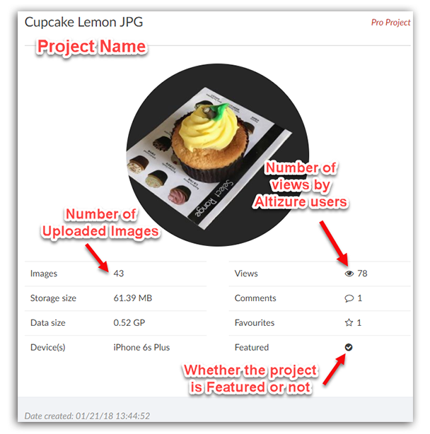
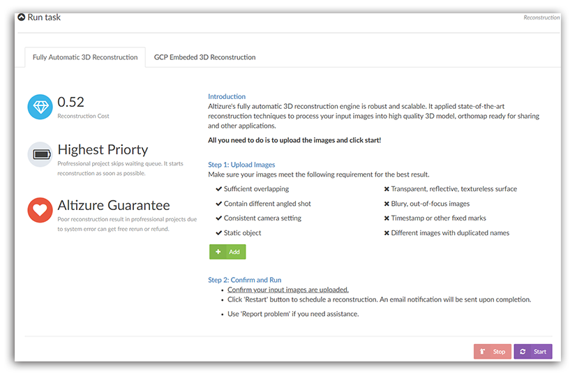
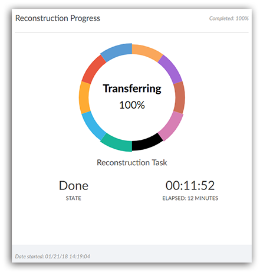
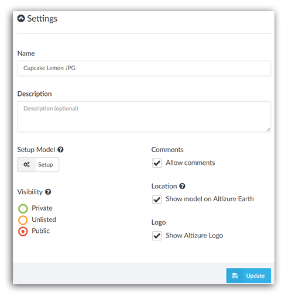
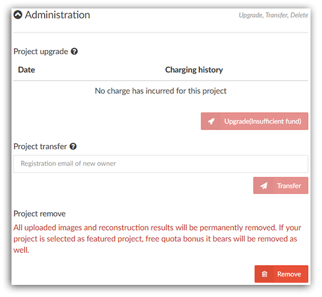
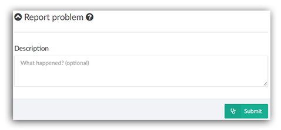
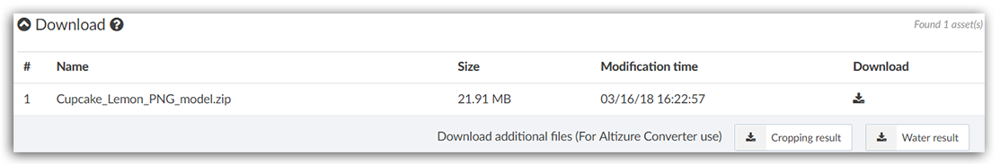

# 项目概况页面{#overview}

**项目概况页面**显示单个项目的概况，让项目所有者可以浏览和管理输入、输出和重建过程。在这里，项目所有者可以取消或启动重建，上传输入图像，下载模型文件输出结果，反馈问题以及进行相关的项目设定，譬如调整项目的公开度、重新命名项目等等。

* [如何进入项目概况页面](#enter)
* [项目信息卡](#info)
* [执行任务卡](#runtask)
* [模型重建进度卡](#progress)
* [项目设定卡](#settings)
* [项目管理卡](#admin)
* [报告问题卡](#problem)
* [下载卡](#download)

## 如何进入项目概况页面 {#enter}

您可以在 **我的项目** 里，任意点选其中一个项目，进入这个项目的 **项目概况** 页面。

## 项目信息卡 {#info}

**储存大小 & 数据大小：** 更详尽的解释，请看[这篇文章](datasize.md)。

**图像：**您所有上传的图像。

**设备：**采集这个项目的图像时，所使用的设备。

**观看：**Altizure用户观看这个模型的浏览次数。

**评论：**Altizure用户对这个模型进行了多少条评论。

**喜欢：**多少Altizure用户收藏了这个模型。

**精选：**这个项目是否又被选为 **精选项目**。

## 执行任务卡 {#runtask}

**添加图像：**对项目增添图片。有关添加图像的要求，请看[这里](add-photo.md)。

**停止：**在重建途中，停止这个项目的重建过程。

**开始：**有时候，您的项目没有启动成功。这时候，您就需要登陆 **项目概况** 页面，点击这个 **开始** 按钮，重启这个项目。如果重启仍不成功，您可以使用本页面的 **报告问题** 功能，将问题报告给我们。

**控制点三维重建（目前接受申请）：**您可以在此添加控制点。本功能需要用户申请，请将您的测绘相关资质，公司营业执照等，发送至**support@altizure.com**，申请开放控制点功能。

## 模型重建进度卡 {#progress}

### 不同重建进度的含义 {#meaning}

* **N/A:** 您还未启动该项目。您需要点击**项目概况**页面的 **开始** 让 Altizure 重启这个项目的重建过程。

* **等待中** Altizure 已经收到了开始重建的命令，但是现在没有空闲的计算资源，所以项目排在队列里等待计算资源。请耐心等待。
 
  **请注意：**如果您在这个时候停止并重启项目，您的项目将被放到队列的最后，这会让您等待更长时间。

* **图片不足：** 该项目的图像不足。Altizure 的每个项目需要至少两张图像。您可以在**项目概况**页面的 **执行任务**面板里，点击 **添加图像**，上传更多图片。然后点击 **开始** 重新启动您的项目。

* **失败：** 该项目重建失败。很有可能因为拍摄图像的方式不对。例如相片之间没有足够的重叠度，图像曝光过暗，过亮或者图像模糊。如果您对结果有任何疑问，请点击 **报告问题** 直接联系并授权技术支持团队帮您检查您的项目。

* **没有改变：** 该项目的图像没有改变，没有必要重新运行。

* **完成：** 项目重建成功。

## 项目设定卡 {#settings}

**名称：**您可以重新命名这个项目。

**介绍：**您可以写一两句话，简单介绍下这个模型，或者写下您想写的任何文字。其他用户浏览您的模型时，会看到这段文字。

**设定模型浏览** [**项目设定页面**](setup-page.md)的入口。

**评论：**不论您是免费项目还是专业项目，您都可以 **允许** 或 **不允许** 其他用户对您的模型进行评价。如果您 **允许** 进行评论，您可以在[三维模型页面]((model-page.md#light))看到这些留言。

**地理位置：**如果您上传的图像包含GPS地理位置信息，那么您的模型就会显示在Altizure地球上。不论您是免费还是专业项目，您都可以选择是否要在Altizure地球上显示。

**标识：**如果专业项目用户不想在自己的模型上显示Altizure的商标logo，那么可取消此选项。

**公开度：**您可以选择将项目设为 **公开**, **不可见 **or **私有**。对于免费项目用户，您的项目只能是 **公开**。

* **公开** 选项会将您的项目列在我们的[**探索页面**](https://www.altizure.cn/)中，所有人都有机会发现并浏览您的结果。

* **不可见** 选项不会将您的项目列在我们的网站上，您的项目只能通过网址（URL）来访问。您可以把结果的链接分享给您指定的人群。但是，请注意任何人都可以看到您的结果，只要他们有准确的 **链接地址**。
  
  不过请注意，这里的 **链接地址** 是指，以`/model`结尾的网站，即：[**三维模型页面**](model-page.md).

* **私有** 选项保证您的项目是完全私有、安全的。只有使用项目所有者的帐号，才可以访问项目的内容。

## 项目管理卡 {#admin}

**升级：**您可以将免费项目升级为专业项目。如果您账户里的Alticoins不足以支付您的模型，那么请您在[**价格页面**](https://site.altizure.cn/pricing)购买Alticoins。更多有关如何将免费项目升级到专业，情况[这里](upgrade-free-to-pro.md)。

**转让：**如果您想将您的项目转给另外一个用户，请在此输入那个用户的Altizure注册邮箱。请注意，一旦您将项目转给其他人，那么您就失去对这个项目的管理和编辑的权力，您只能使用[**三维模型页面**](model-page.md)上的功能。您不能做其他任何修改。

**删除：**点击此按钮，删除这个项目。

## 报告问题卡 {#problem}

如果您有其他关于您项目的问题，请使用这个功能，将问题报告给我们。

比如，如果您想问，“为什么模型有些地方重建效果不理想”，或“我的项目为什么停在某一步”，您都可以使用这一功能。

## 下载卡 {#download}

专业项目用户可在此下载OBJ模型文件。如果您想了解更多有关我们提供的下载模型，您可以看[这篇文章](downloadable-assets.md)。样例模型下载，在[这里](downloadable-assets.md#sample)。

**剪裁结果** & **水面效果**：如果您裁剪了模型或在模型上添加了水面，您可以将您的模型下载后，使用Altizure桌面版里的格式转换器，通过**项目obj模型转换 &gt; crop&water** 的方式，将OBJ模型与剪裁和水面路径合并起来。

**模型大小：**下图中，模型大小为21.91MB。若想了解更多有关 **模型大小** 的内容，请看[这篇文章](datasize.md#model).

---

本文档最后修改于 {{ file.mtime }}

