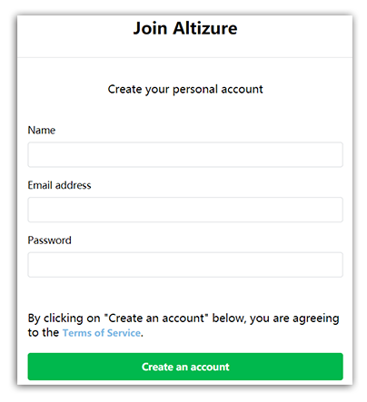
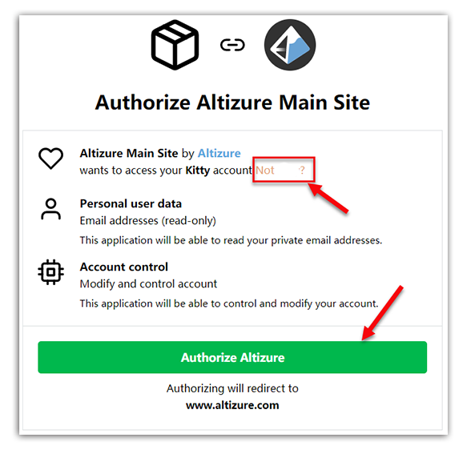

# 登陆Altizure.cn，注册账号

注册 Altizure 账号之后即可获得 3GP 的免费额度进行建模，同时，您可以通过发布高质量的重建结果来提高您的免费额度。当您的一个公开项目成为 Altizure 精选项目时，您的免费额度会在3GP的基础上，增加和您的精选项目同样大小的额外额度。简单说来，只要不停的重建质量较好的模型，且项目大小不断增加，您的免费额度就可以无限升级。详情请见：[这篇文章](upgrade-free.md)

Altizure账户注册步骤如下：

第一步：登陆Altizure.cn，在顶部菜单栏，点击 **登入**。

第二步：点击 **Create an account**。

第三步：输入账户信息，点击 **Create an account**。

第四步：点击 **Authorize Altizure**，完成注册。

对于拥有两个或两个以上的Altizurez账户的用户，如果您频繁登陆会退出账号，有可能有时您并没办法

完全退出一个账户，电脑系统会自动跳转到下图所示的页面。这时，您就需要点击 **Not </帐户名/>**，即，告诉系统您要登陆的不是这个账户名，接下来，系统就会将您带到登入页面了。

--- 

本文档最后修改于 {{ file.mtime }}
