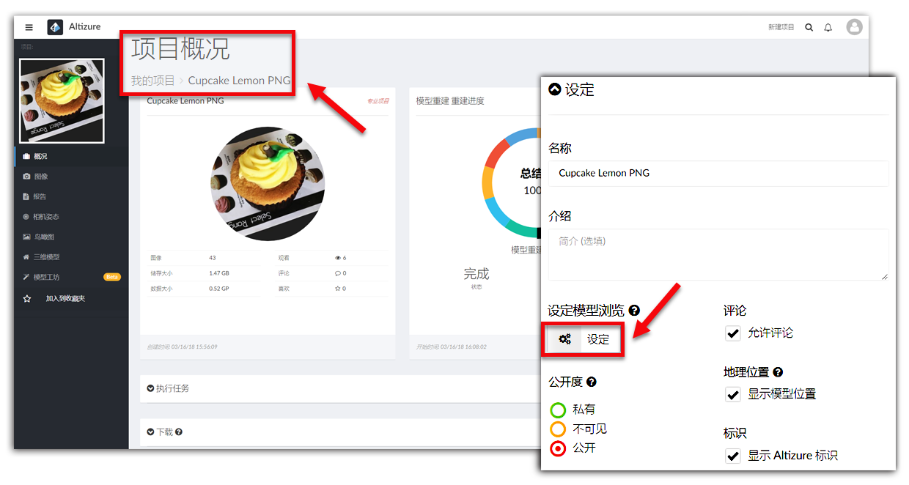
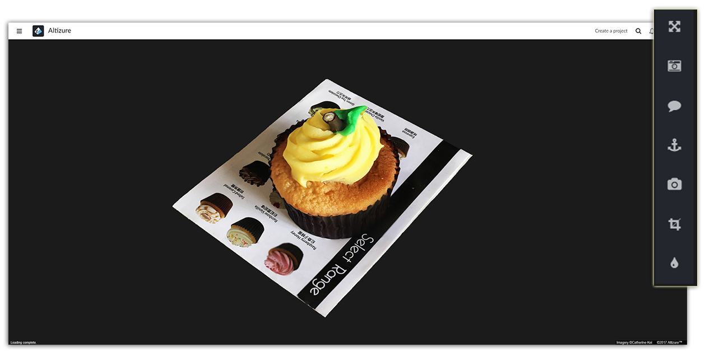
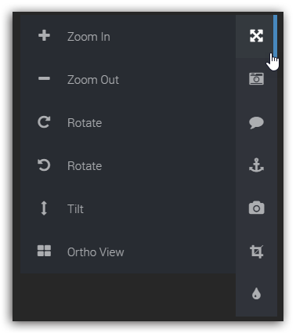
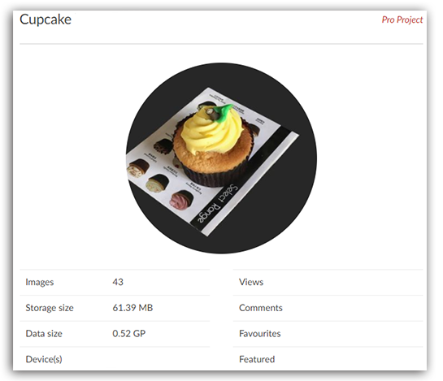
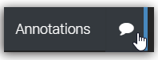
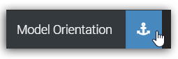
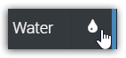

# 项目设定页面

在这里，项目所有者可以进行对模型的设定，比如设置初始相机位置、重新进行GPS校准、添加注释等等。在部分教程里，**项目设定模式** 亦指 **项目设定页面**。

* [如何进入项目设定页面](#enter)
* [模型浏览工具](#viewingangle)
* [设定封面按钮](#thumbnail)
* [注释按钮](#annotation)
* [模型朝向按钮](#orientation)
* [相机设定按钮](#camera)
* [裁剪工具](#crop)
* [水面工具](#water)

### 如何进入项目设定页面 {#enter}

您可以在 **我的项目** 里 >> 任意点选其中一个项目 >> 进入这个项目的 **项目概况** 页面 >> 点击 **项目设定** 按钮 >> 进入 **设定模式**。

## 模型浏览工具 {#viewingangle}
**三维模型页面**也有同样的工具。正如下图所示，您可以放大/缩小，或旋转模型。您也可以使用鼠标操作模型，比如，滑动滑鼠放大/缩小模型，左击可前后左右平移模型，右击可旋转模型。

**但请注意，**如果您点击 **鸟瞰图** 按键，您得到是一张二维正射图，而非在三维空间里，从顶部观看模型。

## 设定封面按钮 {#thumbnail}

模型的封面比较重要，因为它会在多处显示，比如，您的Altizure个人主页，或其他人在搜索您的模型时，第一眼看到的，也是您的模型封面。换句话讲，模型封面就是您的模型给人的第一印象。另外，您截取模型封面的视角，也是访问者浏览您的模型的起始视角。

如何更改模型封面，请看这篇 [**教程**](thumbnail.md)。

## 注释按钮 {#annotation}

用户可在模型上添加注释。每一个注释会被附在模型表面，模型如果移动，注释也会跟着移动。每个注释在三维地图上都有一个特殊的符号、题目和信息描述。用户可在“描述”中嵌入图片或链接。

更多有关如何使用注释工具，请看这篇 [**教程**](mark-or-tag.md)。

## 模型朝向按钮 {#orientation}

有时候，如果图像并没有成功嵌入gps地理位置信息，那么系统很难判断，重建出来的模型是朝南还是朝北，是朝上还是朝下。这可能会导致，模型上下颠倒或没有朝向正确的方位。这时候，我们就需要通过设定 **模型朝向** 告诉电脑，哪里是正确的方向。

更多有关如何使用模型朝向工具，请看这篇 [**教程**](orientation.md)。

## 相机设定按钮 {#camera}

您可以使用此功能，更改默认或预先设定的浏览角度和浏览高度。更多有关如何使用相机设定工具，请看这篇 [**教程**](model-viewing.md)。

## 裁剪工具 {#crop}

您可以快速清理的您的模型。更多有关如何使用裁剪工具，请看这篇 [**教程**](cropping.md)。

## 水面工具 {#water}

对水面进行重建，一直是三维重建领域中的难点。不过，如果用这个工具，用户可以先将重建效果不理想的水面裁剪掉，然后再在同一个地方，添加Altizure开发的水面效果。

更多有关如何使用水面工具，请看这篇 [**教程**](#water-surface.md)。

---

本文档最后修改于 {{ file.mtime }}

