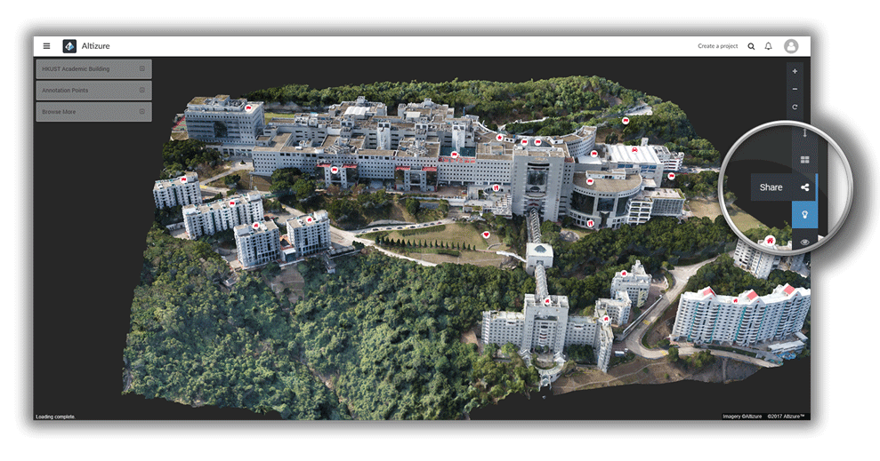
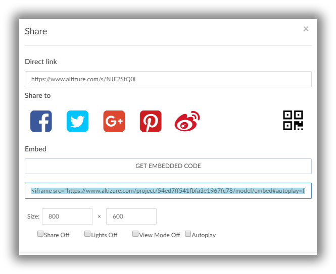

# 收藏、分享、嵌入Altizure模型

* [分享三维模型](#share)
* [将三维作品内嵌到自己的主页或博客上](#embed)
* [收藏有意思的三维作品，或给其他作品点赞](#favorite)


<a name="how"></a>
# 如何把有意思的航拍三维作品分享到其他社交网络上？ {#share}

只需一个按键即可分享。在作品的三维浏览页面，点击**分享**按钮，选择您喜欢的社交网络，即可分享。当前 Altizure 支持直接分享到脸书，推特，Google Plus，Pinterest，和微博。




# 可以把航拍三维作品内嵌到我自己的主页或者博客上吗？  {#embed}

当然可以！您可以把航拍三维作品直接**嵌入**到自己的网页上，这样访问您的页面的访客无需额外跳转到其他页面即可直接浏览您的航拍三维作品。浏览体验无缝接合，酷毙了！

把航拍三维作品嵌入页面只需简单几步：

* 在三维浏览页面点击**分享**按钮 → 点击**获取嵌入代码**按钮 → 拷贝相关代码粘贴到想嵌入的网页里。一切就是如此简单！！！

您还可以设置一下嵌入网页的三维浏览器的效果。例如：可以指定嵌入的三维视窗的大小，选择是否自动加载三维模型，以及指定在加载三维模型后摄像机是否自动做环绕运动。

以下是一个把航拍三维作品嵌入网页的例子：

嵌入代码如下：

```
<iframe src="https://site.altizure.cn/project/590c784c1225725be9d360db/model/embed#autoplay=false" style="border:none;width:640px;height:480px"></iframe>
```

效果如下：

<iframe src="https://site.altizure.cn/project/590c784c1225725be9d360db/model/embed#autoplay=false" style="border:none;width:640px;height:480px"></iframe>


# 我发现一个很有意思的航拍三维作品，我能够点赞吗？ {#favorite}

为什么不呢？点击三维模型页面左上角的 **菜单** 按钮，在出现的左侧栏中，点击 **加入到收藏夹** ☆按钮，即可送上自己的掌声！
项目作者会收到一个系统通知，得知自己的作品获得大家的赞赏。同时您也可以在**我的收藏**页面中看到自己曾经点过赞的作品。


--- 

本文档最后修改于 {{ file.mtime }}