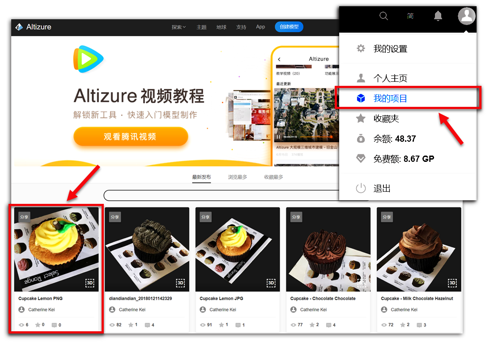
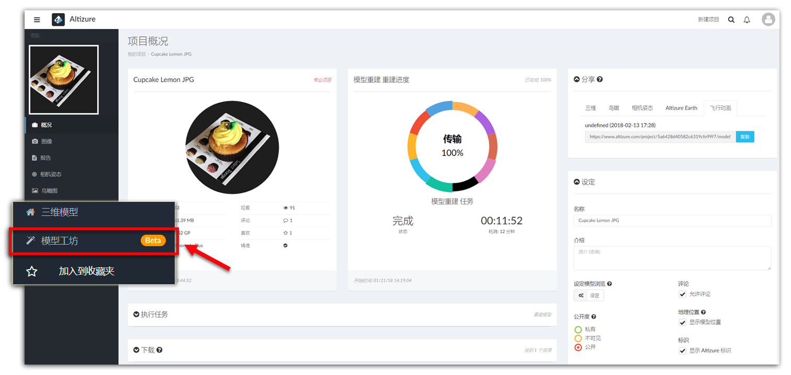
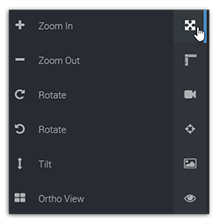
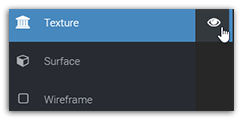

# 模型工坊 {#studio}

**模型工坊页面** 是一个包含很多功能的三维模型浏览器。用户可在页面上测量任意两点间的距离，拾取任意一点的坐标，或在不同浏览模式之间切换。

* [如何进入模型工坊](#enter)
* [模型浏览工具](#viewingangle)
* [三维测量工具](#measure)
* [飞行动画按钮](#ani)
* [拾取坐标按钮](#coor)
* [可见图片按钮](#images)
* [浏览模式按钮](#mode)

## 如何进入模型工坊 {#enter}

您可以在 **我的项目** 里 >> 任意点选其中一个项目 >> 打开 [左侧菜单栏](left-sidebar.md) >> 点选 **模型工坊**.

## 模型浏览工具 {#viewingangle}

**项目设定页面** 和 **三维模型页面**也有同样的工具。正如下图所示，您可以放大/缩小，或旋转模型。您也可以使用鼠标操作模型，比如，滑动滑鼠放大/缩小模型，左击可前后左右平移模型，右击可旋转模型。

**但请注意，**如果您点击 **鸟瞰图** 按键，您得到是一张二维正射图，而非在三维空间里，从顶部观看模型。

## 三维测量工具 {#measure}

如果上传图像包含gps地理位置信息，那么您就可以使用这个三维测量工具。比如，您可以测量长度、面积、挖方填方等信息。

更多有关三维测量工具的内容，请看这篇 [**文章**](3d-measurements.md).

## 飞行动画按钮 {#ani}

简单来讲，用户可制作一段简单的模型动画。 

更多有关飞行动画的内容，请看这篇 [**教程**](flight-animation.md).

## 拾取坐标按钮 {#coor}

如果上传图像包含gps地理位置信息，那么您就可以使用这个工具，拾取任意一点的坐标信息。

但请注意，根据国家相关法律的要求，如果模型是在中国境内 ，Altizure将不提供线上坐标拾取的功能。如要查看坐标信息，请把模型升级为专业，然后使用我们的Altizure桌面版离线浏览器，下载模型，方可查看模型坐标。

## 可见图片按钮 {#images}

您可以在模型上，任意选取一个点，系统会自动显示这个点周围的照片。

## 浏览模式按钮 {#mode}

系统默认的浏览模式是 **纹理**。您也可以查看模型的 **网格** 和 **表面**模式。

**三维模型页面**也有相同功能，您可以在[**这里**](model-page.md#mode)查看更多有关此功能的内容。

--- 

本文档最后修改于 {{ file.mtime }}
